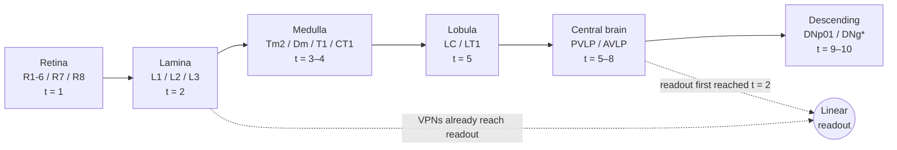
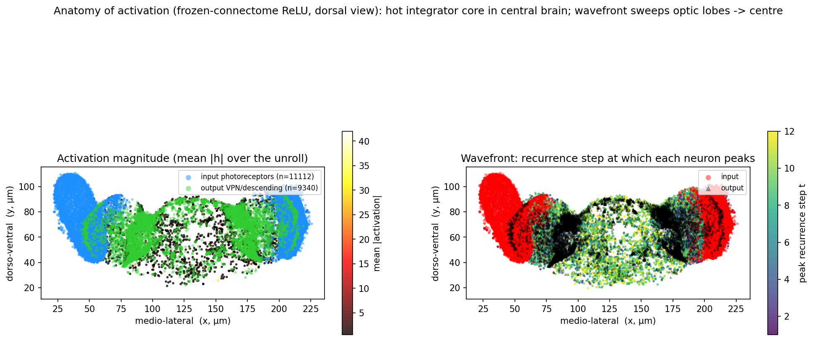
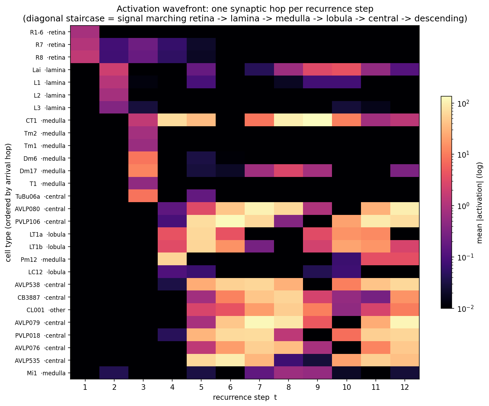
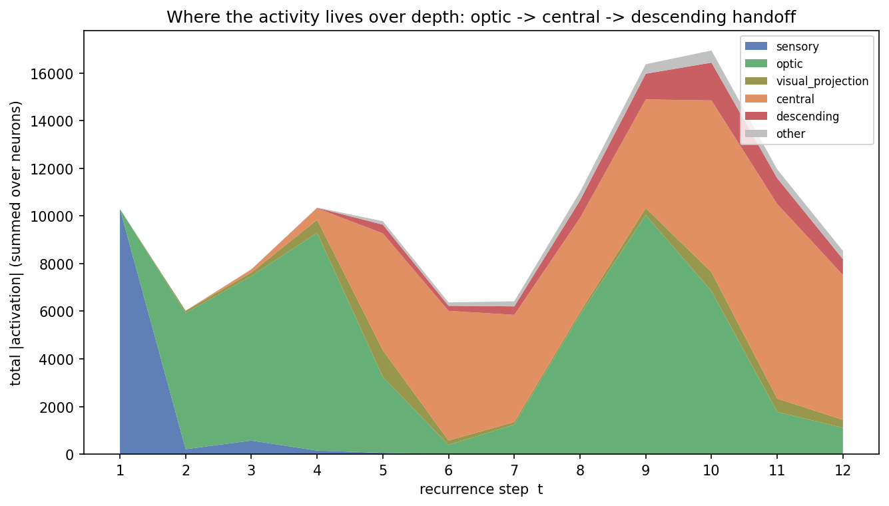
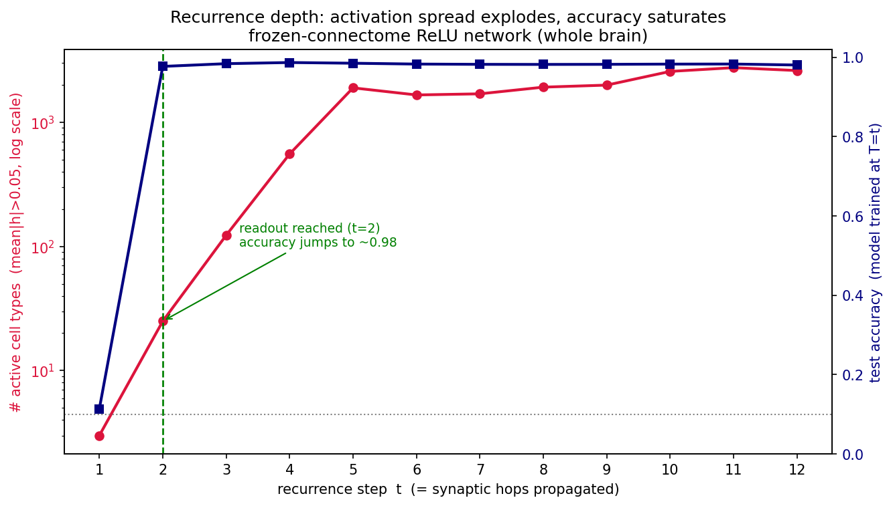
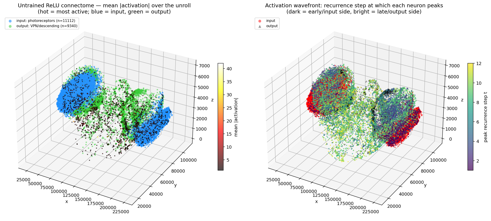
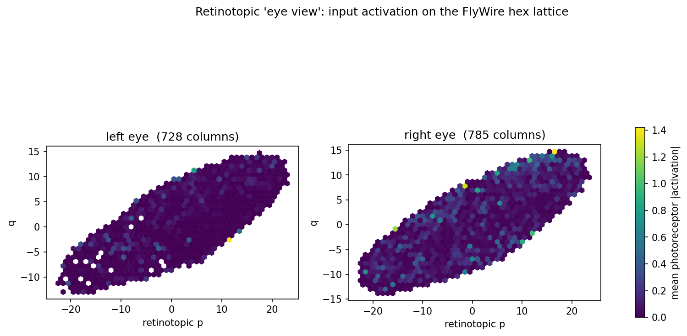

# Activation Pathways in the Frozen-Connectome ReLU Network

How a *Drosophila* connectome — never trained on this task — routes a digit image to a decision,
one synaptic hop at a time.

**Model:** `eyeTact_whole_learned_relu_untrained_T12`. The whole FlyWire connectome (139,255
neurons, 2,630,012 signed + weighted edges) is run as a depth-12 recurrent network on MNIST. The
connectome is **frozen at its measured biological values** (real synapse-count magnitudes, real
Dale signs); only a linear input encoder (784 → photoreceptors) and a linear readout
(output neurons → 10 classes) are trained. **Test accuracy: 98.0%** (T=12), 98.2% (T=8).

> The point of this report: with the wiring frozen, *the connectome itself* is what transforms
> pixels into a separable representation. So the activation pattern over the recurrence is a direct
> readout of which biological pathway the wiring uses to do the task.

---

## TL;DR

- **One synaptic hop per recurrence step.** Activity marches `retina → lamina → medulla → lobula →
  central brain → descending neurons` — exactly one stage per step `t` — reproducing the textbook
  *Drosophila* visual-to-motor circuit.
- **ReLU floods the brain.** The number of active cell types explodes `3 → 25 → 123 → 555 → 1891 →
  … → 2606` over the 12 steps. Because ReLU doesn't decay, the signal keeps spreading.
- **Accuracy saturates the instant the signal reaches the output.** It is at chance (11%) at `t=1`,
  jumps to **97.7%** at `t=2` when the readout is first reached, peaks at **98.7%** (`t=4`), and is
  then flat. Extra recurrence floods more neurons but does **not** change accuracy.
- **The most active neurons are central-brain integrators** (PVLP/AVLP) and the giant GABAergic
  optic hub **CT1** — the populations that pool the visual signal toward the output.
- **Depth = synaptic distance.** The connectome solves the task within ~2–3 hops; everything deeper
  is biologically faithful flooding, not added computation.

---

## 1. Setup: the model and the activation measure

Each neuron carries one continuous activation (a rate, not a spike). At recurrence step `t` the
state vector `h_t` is `[batch, 139255]` — one value per neuron. We push the 10,000-image MNIST test
set through the frozen network and record, for every neuron and every step, the **mean magnitude of
its activation**, `mean |h_t|`. We use magnitude because the connectome is signed: inhibitory
(GABA/Glut) neurons are driven strongly *negative*, and we care that they are *engaged*, not about
the sign.

The image enters **only at the photoreceptors** (11,112 input neurons: R1-6/R7/R8) and the decision
is read **only from the biological output population** (9,340 readout neurons: visual-projection +
descending). Both ends are anatomically constrained, so any signal that reaches the readout had to
travel *through the wiring*.



*The conceptual circuit. The figures below show this is what the network empirically does.*

---

## 2. Which neurons activate — the integrator core

Averaged over the whole unroll, the most active neurons are **not** the photoreceptors (which only
carry the raw injected image) but the **central-brain integration neurons** that pool the visual
signal, plus the brain-spanning optic hub **CT1**.

**Table 1 — Top 15 neurons by mean activation** (full 200 in `…/activity/…__top_neurons.csv`):

| root_id | cell_type | super_class | side | mean \|act\| | role |
|---|---|---|---|---:|---|
| 720575940618321364 | **PVLP106** | central | left | 42.0 | central integrator |
| 720575940625102224 | **AVLP079** | central | right | 40.7 | central integrator |
| 720575940626979621 | **CT1** | optic | left | 33.4 | giant GABAergic optic hub |
| 720575940608545219 | **AVLP080** | central | right | 31.9 | central integrator |
| 720575940616736198 | PVLP106 | central | right | 31.7 | central integrator |
| 720575940608287497 | **AVLP535** | central | left | 29.8 | central integrator |
| 720575940628908548 | CT1 | optic | right | 26.7 | giant GABAergic optic hub |
| 720575940627796298 | AVLP080 | central | left | 25.9 | central integrator |
| 720575940623113752 | **AVLP538** | central | left | 25.7 | central integrator |
| 720575940612264817 | AVLP079 | central | left | 25.5 | central integrator |
| 720575940629609457 | **PVLP018** | central | right | 24.6 | central integrator |
| 720575940621820404 | PVLP018 | central | left | 23.4 | central integrator |
| 720575940606149321 | AVLP076 | central | right | 16.5 | central integrator |
| 720575940620196929 | AVLP435a | central | left | 14.0 | central integrator |
| 720575940647228468 | **DNg100** | descending | right | 12.3 | **output (descending)** |

(Any `root_id` is clickable in the FlyWire Codex: `codex.flywire.ai/app/cell/<root_id>`.)

**PVLP** and **AVLP** are the posterior/anterior ventrolateral protocerebrum — the central-brain
regions where visual information converges. **CT1** is one of the connectome's biggest hubs (a
single GABAergic cell tiling an entire optic lobe). The presence of **DNg100**, a descending neuron,
in the top list shows the signal reaches the motor-output channel. Geometrically, these sit in the
central brain between the two optic lobes:



*Left: mean activation magnitude (hot = most active), with input photoreceptors (blue) on the
optic-lobe surfaces and output VPN/descending neurons (green). The hot core sits in the central
brain. Right: the same neurons colored by the recurrence step at which they peak — a literal spatial
wavefront sweeping from the lateral optic lobes inward.*

---

## 3. The per-depth wavefront — one synaptic hop per step

The clearest result. Tracking the *exact most-active neurons at each recurrence step* reveals the
signal advancing precisely one synaptic stage per step:

**Table 2 — Top neurons at each recurrence depth** (the literal staircase; from
`…__per_depth_neurons.csv`):

| t | top neurons (cell type) | pathway stage |
|---|---|---|
| 1 | R1-6, R1-6, R1-6, R1-6, R1-6 | **retina** (injected image) |
| 2 | L2, L2, L1, L1, L1 | **lamina** |
| 3 | Tm2, Tm2, T1, Dm6, Tm2 | **medulla** |
| 4 | Pm12, Pm12, **CT1**, CT1, Pm02 | **deep medulla + CT1 hub** |
| 5 | PVLP106, AVLP535, LT1a, AVLP435a, LT1b | **lobula → central** |
| 6 | PVLP106, AVLP535, PVLP018 | central protocerebrum |
| 7 | AVLP079, AVLP080, PVLP018 | central protocerebrum |
| 8 | AVLP079, AVLP080, CT1 | central protocerebrum |
| 9 | CT1, CT1, **DNp01**, **DNge050** | **descending neurons** |
| 10 | **DNge050, DNg75, DNg13**, CB0534 | descending output (peak) |
| 11 | PVLP106, AVLP535, PVLP018 | central (re-circulated) |
| 12 | AVLP079, AVLP080, PVLP106 | central (re-circulated) |

This is the visual system in order: `R1-6 → L1/L2 → Tm2/medulla → CT1 → PVLP/AVLP → descending`. The
same structure appears as a heatmap across all major cell types — a diagonal **staircase**, each
type igniting at its synaptic-distance step:



*Rows are cell types ordered by arrival hop; columns are recurrence steps; color is mean
\|activation\| (log). The black silent triangle in the lower-left is the key feature: deep neurons
stay dark until the wavefront reaches them. Retina lights at t=1, lamina at t=2, medulla at t=3,
lobula/central at t=5, descending later — one hop per step.*

The handoff is just as clear when neurons are pooled by **super-class** — sensory dominates at t=1,
the optic lobe peaks mid-unroll, central rises, and descending appears last:



**Table 3 — total activation by super-class and depth** (peak step in **bold**; from
`figs/activation/table3_superclass_by_depth.csv`):

| super_class | t1 | t2 | t3 | t4 | t5 | t6–8 | t9 | t10 | t11 |
|---|---:|---:|---:|---:|---:|---:|---:|---:|---:|
| sensory (retina) | **10296** | 210 | 568 | 150 | 55 | ~1 | 3 | 6 | 4 |
| optic lobe | 0 | 5715 | 6912 | 9140 | 3186 | 1238–5851 | **10037** | 6842 | 1771 |
| visual_projection | 0 | 92 | 144 | 548 | **1120** | 110–183 | 291 | 789 | 557 |
| central | 0 | 0 | 132 | 485 | 4909 | 3955–5445 | 4563 | 7213 | **8172** |
| descending | 0 | 0 | 0 | 16 | 366 | 211–736 | 1079 | **1586** | 1082 |

Read the bold cells diagonally: **sensory → optic → visual_projection → central → descending** peak
in time order — the visual signal being passed up the pathway, baton-style.

---

## 4. Recurrence depth ↔ activation spread ↔ accuracy (the central result)

This is the figure that ties everything together. As recurrence depth increases:

- **Activation spread explodes** (crimson, log axis): the number of active cell types grows
  `3 → 25 → 123 → 555 → 1891 → … → 2606`. ReLU is non-decaying, so once the wavefront passes a
  neuron it stays lit, and activity floods the whole brain.
- **Accuracy saturates** (navy): chance at t=1, then a near-vertical jump to 97.7% at **t=2** —
  exactly when the wavefront first reaches the readout — a peak of 98.7% at t=4, and a flat ~98%
  thereafter.



**Table 4 — depth → activation spread → accuracy** (from `depth_pathway_relu_untrained.csv`):

| t | # active cell types | readout reached? | test accuracy (model trained at T=t) |
|---:|---:|:---:|---:|
| 1 | 3 | no | 0.114 (chance) |
| 2 | 25 | **yes** | **0.977** |
| 3 | 123 | yes | 0.984 |
| 4 | 555 | yes | **0.987** (peak) |
| 5 | 1891 | yes | 0.985 |
| 6 | 1658 | yes | 0.983 |
| 7 | 1693 | yes | 0.982 |
| 8 | 1916 | yes | 0.982 |
| 9 | 1990 | yes | 0.982 |
| 10 | 2565 | yes | 0.983 |
| 11 | 2750 | yes | 0.983 |
| 12 | 2606 | yes | 0.980 |

**The key insight:** accuracy is controlled by *whether the signal has reached the readout*, not by
how widely it has spread. The decision is essentially made by `t=2–4` (the first few synaptic hops),
and the massive activation flooding from `t=5–12` — thousands more cell types lighting up — adds
nothing to the score. Depth beyond the readout distance is biologically faithful reverberation, not
extra computation for this task.

---

## 5. Biological interpretation

The empirical wavefront *is* the textbook *Drosophila* visual-to-motor pathway, recovered purely
from the frozen wiring:

- **t1 Retina (R1-6/R7/R8)** — the injected image. R1-6 are the outer motion/luminance receptors;
  R7/R8 the inner color receptors.
- **t2 Lamina (L1, L2, L3)** — the first synapse; L1/L2 are the canonical ON/OFF channel splitters.
- **t3–4 Medulla (Tm2, Dm, T1, Mi1)** + **CT1** — columnar processing; CT1 is the giant GABAergic
  cell providing brain-wide inhibitory gain control.
- **t5 Lobula (LC, LT1)** — lobula columnar/tangential cells, the optic-lobe → central-brain bridge.
- **t5–8 Central protocerebrum (PVLP, AVLP)** — where visual features converge and the readout
  population (visual-projection neurons) is engaged.
- **t9–10 Descending neurons (DNp01, DNg*)** — the motor-command output channel to the nerve cord.

That a network **never trained to do this** reproduces the known anatomy of fly visual signal flow
is the report's main biological message: **the connectome's structure performs the routing**;
training only the thin input/output layers is enough to read a digit off the resulting
representation.

---

## 6. Geometric / spatial intuition

The 3D view makes the spatial wavefront explicit. Activity ignites in the two lateral optic lobes
(where the photoreceptors live) and sweeps medially into the central brain, finally reaching the
descending tract:



*Left: overall activation (hot), with input photoreceptors (blue) on the optic-lobe surfaces and
output neurons (green). Right: each neuron colored by the recurrence step at which it peaks (dark =
early/optic-lobe side, bright = late/central + output side).*

And the **input** in its own natural coordinate frame — the retinotopic hex lattice each
photoreceptor occupies (the "eye view"), colored by how strongly the encoded MNIST image drives each
column:



*Both eyes' hexagonal photoreceptor lattices (real FlyWire v783 column coordinates), colored by mean
photoreceptor activation. This is the spatial layout of the image as the network's eye actually
samples it.*

🔄 **Interactive:** a rotatable 3D version with per-neuron hover (root_id, cell type, peak step) is
at [`figs/activation/F_activation_3d_interactive.html`](figs/activation/F_activation_3d_interactive.html)
(open in a browser).

---

## 7. Takeaway

- **Recurrence depth = synaptic distance.** Each step advances activity one synapse; the
  per-depth wavefront (Fig B, Table 2) traces the real `retina → lamina → medulla → lobula → central
  → descending` circuit.
- **The wiring is the computation.** A connectome frozen at its measured values — only the linear
  input/output layers trained — already produces a representation that classifies MNIST at 98%, and
  it does so by routing signal through the biologically correct pathway.
- **The task is solved in ~2–3 hops.** Accuracy jumps from chance to ~98% the instant the wavefront
  reaches the readout (t=2) and is flat thereafter (Fig A, Table 4). The subsequent flooding of
  thousands of neurons (active types → 2606) is faithful neural reverberation, not added compute.

---

### Reproducing this report

```bash
# 1. generate all figures + metrics (one GPU forward pass over the test set)
sbatch slurm/activation_report.sbatch          # -> 3 - Modeling/figs/activation/

# underlying per-neuron, per-step activation extractor:
python -c "from flyconn.models.activity import per_step_neuron_activity"
```

| Artifact | Path |
|---|---|
| Figures A–E (PNG), F (HTML) | `3 - Modeling/figs/activation/` |
| Metrics (every quoted number) | `3 - Modeling/figs/activation/_metrics.json` |
| Top-200 neurons | `…/v783/activity/eyeTact_whole_learned_relu_untrained_T12__top_neurons.csv` |
| Top-5 per depth | `…__per_depth_neurons.csv` |
| Super-class × depth | `figs/activation/table3_superclass_by_depth.csv` |
| Depth → accuracy | `…/v783/activity/depth_pathway_relu_untrained.csv` |
| Generation script | `scripts/activation_report.py` |
| Activation module | `src/flyconn/models/activity.py` |
