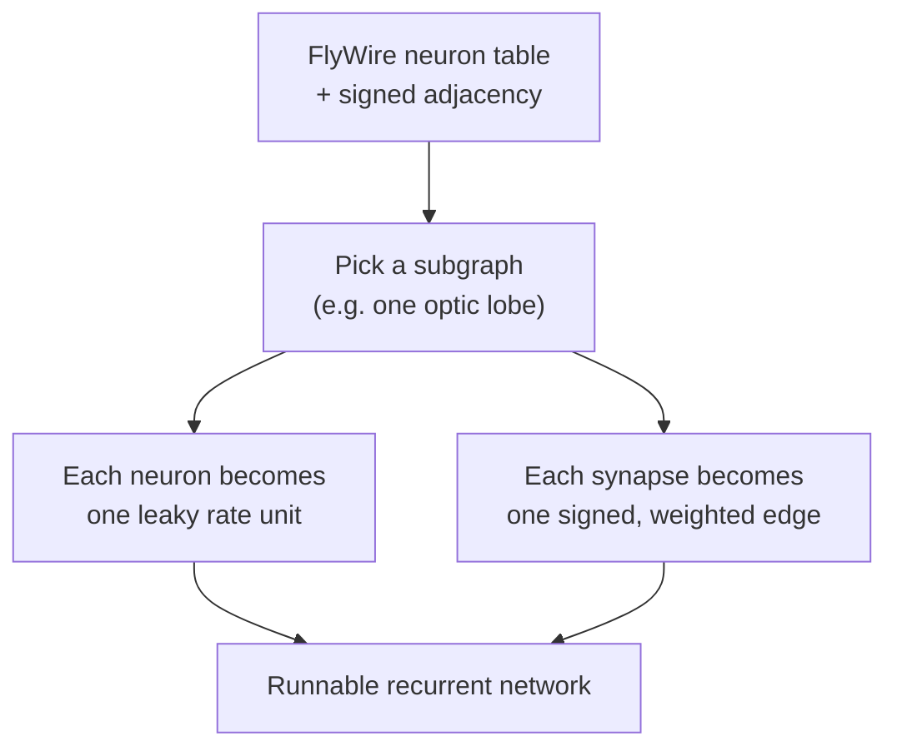
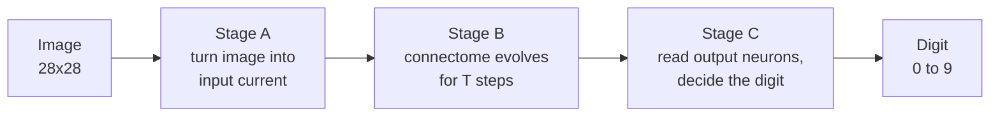
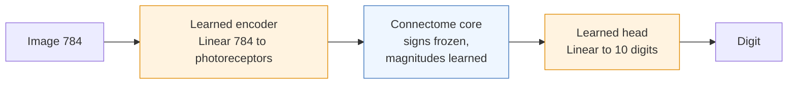
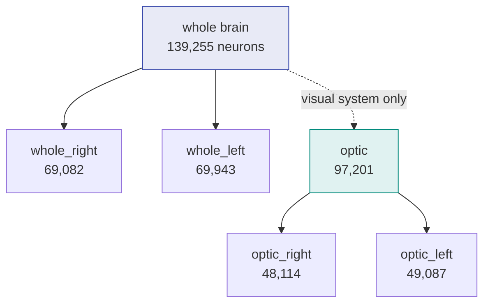
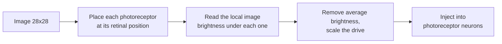
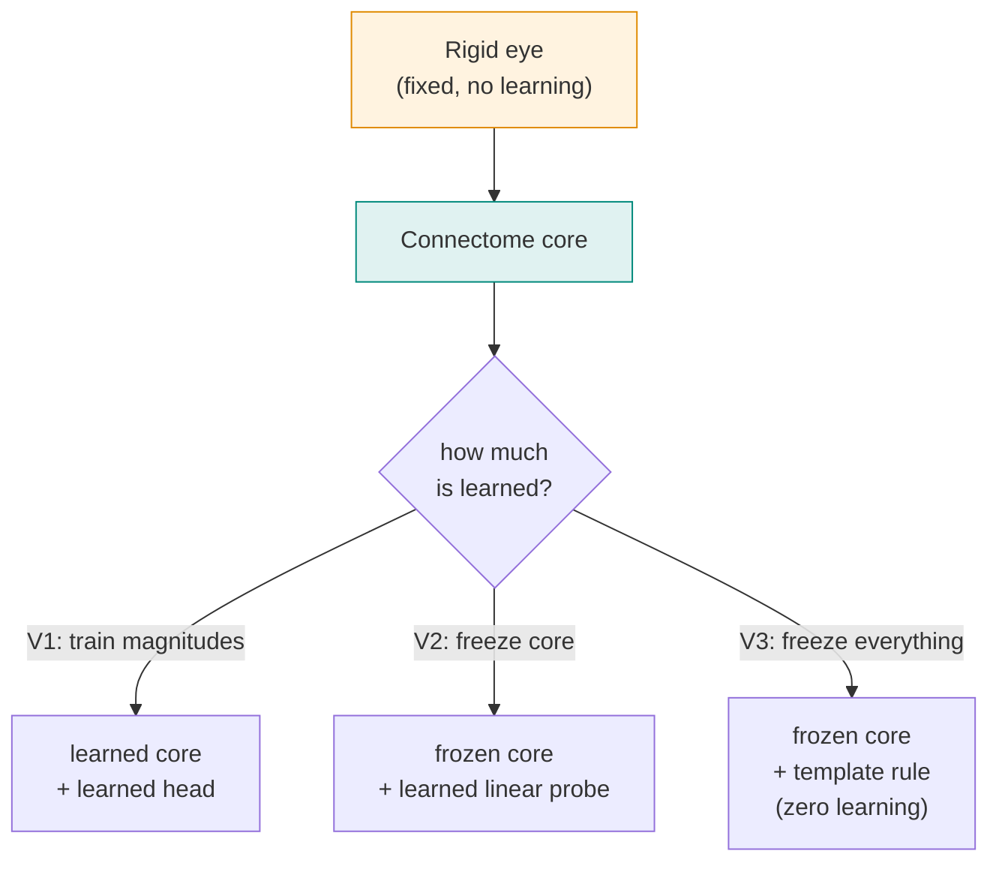

# Stage 3: Models, training, inference, and results

This is the full reference for the Stage 3 models. It walks the whole path: how we go from the
raw *Drosophila* connectome to a working classifier, how each model does inference on an image,
how the trainable models were trained, what the results were, and what they imply. For the short
conceptual tour see [`README.md`](README.md); for the headline accuracy tables see
[`RESULTS.md`](RESULTS.md).

There are two families of models here:

1. **The original 24 models** (a learned input encoder feeds the connectome). These establish
   that a connectome-shaped network can solve [MNIST](http://yann.lecun.com/exdb/mnist/).
2. **The faithful "rigid eye" models** (V1, V2, V3). Here the image enters through a fixed,
   biologically motivated filter instead of a learned encoder, so we can ask the sharper
   question: *how much does the measured fly wiring classify on its own?*

Both families share the same connectome core, so we describe the journey once and then explain
where the two families differ.

---

## Part 1: From raw connectome to a runnable network

### 1.1 The raw data

The starting point is the [FlyWire](https://flywire.ai/) reconstruction of an entire adult
*Drosophila* brain (the FAFB v783 release): every neuron and every chemical synapse between them,
reconstructed from electron microscopy. Two public, CC-BY-4.0 sources feed this project:

- **Connectivity** (which neuron connects to which, and how many synapses): Dorkenwald et al.
  2024, *Nature*, [*Neuronal wiring diagram of an adult brain*](https://www.nature.com/articles/s41586-024-07558-y),
  distributed on [Zenodo (record 10676866)](https://doi.org/10.5281/zenodo.10676866).
- **Annotations** (each neuron's cell type, side, neurotransmitter, position): Schlegel et al.
  2024, *Nature*, [*Whole-brain annotation and multi-connectome cell typing of Drosophila*](https://www.nature.com/articles/s41586-024-07686-5),
  from the [`flyconnectome/flywire_annotations`](https://github.com/flyconnectome/flywire_annotations) repo.

Stage 1 of this project ([`1 - Data Preparation`](../1%20-%20Data%20Preparation/)) downloads these,
verifies them, and produces clean, model-ready tables on scratch: a neuron table
(139,255 neurons, one row each, with cell type, side, neurotransmitter, and 3D position) and a
signed adjacency matrix (the connectivity, with each synapse marked excitatory or inhibitory).

### 1.2 Turning biology into a network

Three modeling decisions turn this anatomy into something a GPU can run. The diagram shows the
flow; the points below explain each box.



- **Neurons become rate units.** Every neuron is modeled as a single continuous activation value
  (a [firing-rate unit](https://en.wikipedia.org/wiki/Biological_neuron_model#Rate_models),
  not a spiking model). At each time step a neuron sums the signed input from its presynaptic
  partners, adds any external drive, and passes the total through a `tanh` nonlinearity.

- **Synapses become signed, weighted edges.** Each real synapse becomes one directed edge. Its
  **sign** (excitatory `+1` or inhibitory `-1`) is fixed by the presynaptic neuron's predicted
  neurotransmitter, following [Dale's principle](https://en.wikipedia.org/wiki/Dale%27s_principle)
  (a neuron releases the same transmitter at all its outputs). In flies, acetylcholine is
  excitatory while both GABA and glutamate are inhibitory. Its **magnitude** is a single learnable
  number per edge. Crucially, the magnitude is always non-negative and the sign is a fixed
  multiplier, so training can make a synapse stronger or weaker but can **never flip it** from
  excitatory to inhibitory or create a connection that does not exist in the fly.

- **We pick a subgraph.** The whole brain is large, so most experiments run on a biologically
  meaningful sub-network (for example, a single optic lobe), described in Part 3.

The exact weight construction, and why we store it as an edge list rather than a dense matrix,
is in [`connectome_net.py`](../src/flyconn/models/connectome_net.py); the implementation notes at
the end of this file cover the non-obvious choices.

### 1.3 How a single model runs (the shared core)

Every model in Stage 3, both families, runs the same three-stage pipeline. An image goes in, the
connectome evolves, and a decision comes out.



- **Stage A (input).** The 28x28 image is converted into an external current that is injected
  **only into the photoreceptor neurons** (the fly's R1-6 / R7 / R8 cells, the real entry point
  for vision). The two model families differ entirely in *how* this conversion happens, which is
  the whole point of the comparison.

- **Stage B (connectome dynamics).** With photoreceptors driven, the network updates for `T`
  steps under its own recurrent dynamics. Signal flows from photoreceptors into the lamina, then
  the medulla, then the lobula, exactly as in the fly visual pathway, because those are the real
  edges. The update rule for the whole network at step `t` is:

  ```
  h(t+1) = (1 - alpha) * h(t) + alpha * tanh( W * h(t) + x(t) )
  ```

  where `h` is the vector of all neuron activations, `W` is the signed, weighted connectome,
  `x(t)` is the injected image current, and `alpha` is a fixed leak. The signs in `W` are frozen
  from biology; only the magnitudes can change.

- **Stage C (decision).** After the unroll, we read the activations of a **biological output
  population** (the visual projection neurons that carry signals out of the optic lobe, plus
  descending neurons for whole-brain models) and turn that activation pattern into a digit. Again,
  the two families differ in how this final step works.

Restricting the input to photoreceptors and the readout to real output neurons is deliberate. If
we let the input layer write to every neuron, or the readout read from every neuron, the model
would become an ordinary multilayer perceptron wearing the connectome as decoration, and we could
no longer tell whether the *wiring* does any work.

---

## Part 2: Family 1, the original 24 models (learned encoder)

These models answer a first question: *can a network whose connectivity and signs are frozen from
a real brain learn to classify images at all?* To give it the best chance, both the input and the
output are small learned layers.



The two orange boxes are freely learned, unconstrained layers. The blue box is the connectome,
where only edge magnitudes are trainable. What is learned versus fixed:

| Component | Status | What it is |
|---|---|---|
| Input encoder | learned | a dense `Linear(784, n_photoreceptors)` map |
| Connectome edge magnitudes | learned | one number per synapse, sign fixed |
| Connectome connectivity and signs | frozen | taken directly from FlyWire |
| Output head | learned | a `Linear(n_readout, 10)` map |
| Per-neuron leak and nonlinearity | fixed | the same for every neuron (no per-neuron tuning) |

### How they were trained

All 24 runs used one recipe (overridable per config, but none were overridden):

- **Data:** [MNIST](http://yann.lecun.com/exdb/mnist/), 60,000 training images split into 54,000
  train and 6,000 validation, plus 10,000 held-out test images. Each image is normalized and
  flattened to a 784-vector. Batch size 128.
- **Optimizer:** [Adam](https://arxiv.org/abs/1412.6980), learning rate 1e-3, cosine-annealed
  over 25 epochs.
- **Loss:** cross-entropy on the 10 output logits.
- **Stability:** gradients are clipped to norm 1.0, and edge magnitudes are rescaled at startup
  so the connectome's [spectral radius](https://en.wikipedia.org/wiki/Spectral_radius) is about
  0.9, which keeps the `T`-step unroll from exploding (there are no per-neuron parameters to
  absorb instability, so this matters).
- **Checkpoint:** the epoch with the best validation accuracy is saved; test accuracy is measured
  once at the end.

### The two flavors and the two initializations

These 24 models vary along two extra axes on top of the subgraph choice (Part 3):

- **Flavor** is how the network is unrolled. `ff_unroll` injects the image once at the start and
  lets it sweep through, behaving like a depth-`T` feedforward pass with tied weights. `rnn`
  injects the image at every step and uses a leaky memory, behaving like a recurrent network
  settling toward a steady state. They use the *same* equations and differ only in the leak and
  the injection schedule.
- **Initialization** is where the edge magnitudes start. `from_data` starts them proportional to
  the real synapse counts, so the network begins as the literal measured wiring. `random` keeps
  the real edges and signs but draws fresh magnitudes from a distribution matched to the real one.
  Comparing the two isolates whether the *specific* measured strengths help, separate from the
  graph structure.

Six subgraphs times two flavors times two initializations gives the 24-run grid.

---

## Part 3: The six subgraphs

A subgraph is a sub-network induced from the whole connectome. `optic*` subgraphs are the visual
system (they contain the photoreceptors, so the image enters through real retina); `whole*`
subgraphs are the full brain or one hemisphere. "Hops" is the shortest path length, in synapses,
from photoreceptors to the readout neurons; `T` is set to at least that, so the signal can
actually reach the output before we read it.



| Subgraph | Neurons | Synapses | Photoreceptors (input) | Output neurons | Hops |
|---|---:|---:|---:|---:|---:|
| `whole` | 139,255 | 2,630,012 | 11,112 | 9,340 (VPN + descending) | 7 |
| `whole_right` | 69,082 | 1,203,860 | 5,352 | 4,678 | 6 |
| `whole_left` | 69,943 | 1,051,651 | 5,760 | 4,654 | 7 |
| `optic` | 97,201 | 1,476,198 | 11,112 | 8,037 (VPN) | 5 |
| `optic_right` | 48,114 | 754,751 | 5,352 | 4,029 | 5 |
| `optic_left` | 49,087 | 635,869 | 5,760 | 4,008 | 5 |

The input is always the photoreceptors (R1-6, R7, R8). The output population is the visual
projection neurons (VPN) for the `optic*` models, and VPN plus descending neurons for the
`whole*` models (descending neurons carry commands toward the motor system, so they only exist in
the whole-brain graphs).

---

## Part 4: Family 1 results and the lesson that motivated Family 2

All 24 models train to roughly **97% on MNIST** (full table in [`RESULTS.md`](RESULTS.md)). The
connectome-shaped network clearly *can* classify. But two observations show the connectome itself
may not be doing much of the work:

1. The learned `Linear(784, photoreceptors)` encoder and the learned readout are, between them, a
   capable two-layer network. They could be carrying most of the load.
2. The `random` initialization slightly **beat** `from_data` in 11 of 12 subgraph-flavor pairs.
   If the measured wiring were doing the heavy lifting, starting from it should help, not hurt.

Together these say: the 97% number tells us the *frame* works, but not how much the *fly's actual
wiring* contributes. To answer that, we need to take away the learned crutches at the input and
output. That is Family 2.

---

## Part 5: Family 2, the faithful "rigid eye" models (V1, V2, V3)

Here the learned encoder is replaced by a **fixed, biologically motivated filter** that delivers
the image to the photoreceptors the way a real eye would. Then we sweep how much of the rest is
learned, from "core plus a head" (V1) down to "nothing at all" (V3). The relevant code is
[`eye.py`](../src/flyconn/models/eye.py) (the eye), [`retinotopy.py`](../src/flyconn/data_prep/retinotopy.py)
(the retinal map), and `RigidEyeClassifier` in [`connectome_net.py`](../src/flyconn/models/connectome_net.py).

### 5.1 The rigid eye (Stage A, now fixed and biological)

The fly eye is a hexagonal array of sampling units pointing in slightly different directions, much
like the regular grid used in the connectome-constrained vision model
[flyvis (Lappalainen et al. 2024)](https://www.nature.com/articles/s41586-024-07939-3). The rigid
eye reproduces this in three fixed steps, with no learned parameters:



- **Retinal position.** Each photoreceptor is placed on a 2D hexagonal grid. The faithful source
  is the FlyWire-native column map (from the [FlyWire Codex](https://codex.flywire.ai/) optic-lobe
  columns and the [`OpticLobe.jl`](https://github.com/hsseung/OpticLobe.jl) hex coordinates), which
  assigns each neuron a real retinal location. A self-contained fallback derives a grid from each
  photoreceptor's recorded 3D position when the column map is not present.
- **Local brightness (box filter).** Each photoreceptor reads the average image brightness over a
  small patch around its retinal position, just as one ommatidium integrates light from a small
  patch of the visual field. This is precomputed as a fixed matrix, so the whole step is a single
  matrix multiply.
- **Normalize and inject.** We subtract the image's average brightness (so the network responds to
  *contrast and shape* rather than to how bright the whole image is) and scale by a fixed gain,
  then write the result into the photoreceptor neurons. Every other neuron starts at zero.

Knobs (all fixed, not learned): drive both eyes or one eye, drive all photoreceptor types or only
the broadband R1-6 cells, and how to handle any photoreceptor that has no assigned column.

### 5.2 The connectome core, with two biology corrections

The core is the same recurrent connectome as Family 1, with two important corrections that matter
once there is no learned encoder to paper over them.

**Correction 1: photoreceptor signs.** The neurotransmitter predictor used to assign synapse signs
has no class for [histamine](https://en.wikipedia.org/wiki/Histamine), which is exactly what fly
photoreceptors release. So in the raw data, photoreceptors are mislabeled with other transmitters,
and about 956 of their synapses get dropped entirely. Real photoreceptors are inhibitory (they
hyperpolarize their lamina targets). Setting `photoreceptor_sign = -1` forces every
photoreceptor synapse to inhibitory and restores the dropped ones (for `optic_left`, the synapse
count rises from 635,869 to 636,066). We keep the raw, uncorrected version too, as a control, to
measure how much this fix matters.

**Correction 2: gain control.** This was a genuine surprise during development and is worth
stating plainly. With no learned encoder or readout to set the scale, the frozen core (spectral
radius about 0.9, `tanh` nonlinearity) shrinks the signal a little at every synaptic hop. After
the three to five hops it takes to reach the output neurons, the image-driven part of the signal
has decayed to about one part in a million, so the readout is effectively blank and every digit
looks identical.

The fix, turned on automatically for the rigid eye, is two-fold and mirrors what real visual
systems do:

- **Per-step normalization:** after each step the activation vector is rescaled to a fixed
  overall size, a form of [divisive normalization](https://en.wikipedia.org/wiki/Normalization_model)
  that biology uses pervasively. This stops the geometric decay.
- **Read the whole trajectory:** instead of reading the output neurons only at the final step, we
  sum each output neuron's activation across all steps, so a neuron is counted whenever its signal
  arrives.

Measured effect on `optic_left`: the image-driven variation at the readout rose from about
0.0000009 to about 1.06, a roughly million-fold restoration. This is what turns the rigid-eye
models from "chance" into the results below.

### 5.3 The readout (Stage C)

We take the output neurons' summed activations, standardize each neuron using statistics from the
training set (subtract its mean, divide by its standard deviation), and hand that vector to the
decision rule. Standardizing matters because, without a learned head to absorb it, a few
high-variance neurons would otherwise dominate.

### 5.4 The three variants

All three use the identical rigid eye and the identical frozen connectome wiring. They differ only
in how much is learned after that.



| | **V1** | **V2** | **V3** |
|---|---|---|---|
| Input eye | rigid, fixed | rigid, fixed | rigid, fixed |
| Connectome magnitudes | learned | frozen (from data) | frozen (from data) |
| Decision | learned head | learned linear probe | template rule, no parameters |
| How it is fit | gradient descent | gradient descent | one pass, no gradients |
| Learned parameters | core + head | head only | **zero** |
| Question it answers | does the rigid eye match the learned one? | is the digit linearly readable from the frozen wiring? | does the wiring alone separate the digits? |

**V1: rigid eye, learnable core, learned head.** Only the edge magnitudes and the final
`Linear(n_readout, 10)` head are trainable. Trained exactly like Family 1 (Adam, cross-entropy,
gradient clipping, 25 epochs, best-validation checkpoint), with gradients flowing back through the
whole unroll. Inference: image, rigid eye, core unroll with the trained magnitudes, standardized
readout, then `argmax` of the learned head.

**V2: rigid eye, frozen core, learned linear probe.** The edge magnitudes are set from the data
and then frozen; only the final linear layer learns. This is a standard
[linear probe](https://arxiv.org/abs/1610.01644): it asks whether the digit is *linearly* readable
from the fixed connectome's output. The probe trains fast because the expensive core is run without
gradients. Inference is the same as V1 but with frozen magnitudes.

**V3: fully rigid, zero learned parameters.** Nothing is learned anywhere. The "fit" is a single
pass over the training set that averages each digit class's readout vectors into a template (the
class mean). The "training" is therefore just computing ten averages, not gradient descent.

Inference for a test image: run it through the rigid eye and frozen core, get the readout vector,
and label it with the **nearest class template** (a
[nearest-class-mean classifier](https://en.wikipedia.org/wiki/Nearest_centroid_classifier)). V3
reports four numbers so the result can be trusted, not just one:

- **cosine (the headline):** standardize the readout, then match by the *angle* to each template.
  Angle ignores overall magnitude, so this measures the *pattern* of activity.
- **raw-euclidean (a floor):** match by plain distance on the un-standardized readout. This partly
  classifies by *how much ink* an image has (a "1" lights fewer pixels than an "8"), so it can beat
  chance for an uninteresting reason. It is the bar the real rules must clear.
- **lda:** nearest template after standardization (a closed-form, learning-free
  [linear discriminant](https://en.wikipedia.org/wiki/Linear_discriminant_analysis) variant).
- **shuffle (a control):** rebuild the templates after randomly scrambling the training labels. If
  the pipeline were leaking the answer this would still score high; it must collapse toward chance.

A V3 result is only believable if cosine and lda clearly beat the raw-euclidean floor (so it is
reading *pattern*, not brightness) and the shuffle control collapses toward 10% (so there is no
leak).

---

## Part 6: Results

### Family 1 (the 24 learned-encoder models)

All 24 reach about 97% on MNIST. Best run: `optic_right` with the `rnn` flavor and `random` init,
at 97.75%. The full table and the `from_data` versus `random` comparison are in
[`RESULTS.md`](RESULTS.md). The takeaway, as noted above, is that this number mostly validates the
setup rather than measuring the connectome's own contribution.

### Family 2 (the faithful rigid-eye models), Phase 1

Phase 1 is the cheapest, most informative slice: the three variants, on `optic_left` and
`optic_right`, with corrected (`fix`) and uncorrected (`raw`) photoreceptor signs, using the
self-contained retinal grid. Run on `pi_tpoggio` A100s through
[`slurm/eye_array.sbatch`](../slurm/eye_array.sbatch). The numbers are on the full 10,000-image
MNIST test set.

**The headline.** As learning is stripped away, the measured connectome keeps classifying:

| What is learned | Accuracy (optic_left / optic_right) |
|---|---|
| V1: core magnitudes + head | **96.3% / 96.5%** |
| V2: only a linear probe (core frozen) | **93.9% / 94.0%** |
| V3: nothing at all | **57.4% / 48.9%** (cosine; chance is 10%) |

**V1 (learnable core + head):**

| Subgraph | Sign | Test accuracy |
|---|---|---:|
| `optic_left` | fix | 0.963 |
| `optic_right` | fix | 0.965 |

V1 lands within about one point of the original learned-encoder models (~0.97). So swapping the
learned encoder for the fixed biological eye costs almost nothing, once the core can train.

**V2 (frozen core + linear probe):**

| Subgraph | fix | raw |
|---|---:|---:|
| `optic_left` | 0.939 | 0.935 |
| `optic_right` | 0.940 | 0.937 |

A single linear layer reading the **frozen** connectome reaches about 94%. The digit identity is
strongly and *linearly* present in the fixed wiring's output; the connectome is doing real feature
extraction, not passing along noise for a powerful head to rescue.

**V3 (zero learned parameters), full test set, chance is 0.10:**

| Subgraph | Sign | cosine | raw-euclid (floor) | lda | shuffle (control) |
|---|---|---:|---:|---:|---:|
| `optic_left` | fix | 0.574 | 0.508 | 0.567 | 0.200 |
| `optic_left` | raw | 0.603 | 0.552 | 0.607 | 0.142 |
| `optic_right` | fix | 0.489 | 0.418 | 0.472 | 0.156 |
| `optic_right` | raw | 0.515 | 0.433 | 0.504 | 0.148 |

Every run beats chance by a wide margin, cosine and lda clearly exceed the raw-euclidean floor on
every run, and the shuffle controls collapse toward chance. So **the measured fly visual wiring,
with zero learned parameters, classifies handwritten digits at roughly 49 to 60%.**

---

## Part 7: What it implies

- **The wiring carries real visual structure.** The clean ladder, 96% with a trainable core, 94%
  with only a linear probe, and roughly 50 to 60% with no learning at all, shows the signal is
  genuinely in the fixed connectome, not supplied by a learned input or output stage. Even the
  bare wiring is five to six times better than chance.

- **A faithful input costs almost nothing.** Replacing the learned 784-to-photoreceptor encoder
  with a fixed, eye-like filter barely moves V1's accuracy (about 96% versus about 97%). We do not
  need an unconstrained learned front end to make the connectome usable; a biologically honest one
  works nearly as well.

- **Gain control is essential, not cosmetic.** A frozen biological network cannot be run open-loop;
  without per-step normalization the signal never reaches the output. That the fix which works is
  exactly the divisive normalization real visual systems use is a small piece of evidence that the
  modeling choices are pointed in the right direction.

- **The biology sign-fix is nuanced.** Forcing photoreceptors to be inhibitory (the correct
  biology) slightly *lowers* the zero-learning V3 score but slightly *raises* the trained V2 score.
  In other words, the correction is the right default once anything is trained, but it is not a free
  win for a bare nearest-template rule. This is the kind of subtlety the variant ladder was built to
  expose.

- **Left beats right, slightly.** `optic_left` edges out `optic_right` across all variants. With
  the self-contained retinal grid this is expected (the two eyes' grids differ a little); the
  faithful FlyWire column map should narrow the gap and is the natural next step.

---

## Part 8: How to run it

```bash
# Generate the rigid-eye Phase-1 configs (10 of them).
python -m flyconn.models.run eye_grid

# One model at a time. V1 and V2 train by gradient descent; V3 is a single fit pass.
python -m flyconn.models.run train     --config configs/eye_experiments/optic_left_V2_fix.yaml
python -m flyconn.models.run fit_rigid --config configs/eye_experiments/optic_left_V3_fix.yaml

# The whole Phase-1 grid on SLURM. Each config's `stage:` field routes train vs fit_rigid.
sbatch slurm/eye_array.sbatch
python -m flyconn.models.run aggregate     # collate into one results table

# The original 24-model grid.
python -m flyconn.models.run grid
sbatch slurm/train_array.sbatch
```

`eye_grid --full` expands to all variants across all six subgraphs (Phase 2, which adds both-eye
and whole-brain models, where the signal can reach the descending neurons).

Per-run outputs land on scratch under `…/v783/models/<run>/` (`summary.json`, `metrics.jsonl`,
`ckpt_best.pt`). The aggregate table is `…/v783/results/summary.csv`.

---

## Part 9: Implementation notes

These are the non-obvious engineering choices that make the above correct and tractable. Full code
in [`connectome_net.py`](../src/flyconn/models/connectome_net.py),
[`subgraphs.py`](../src/flyconn/models/subgraphs.py), and [`eye.py`](../src/flyconn/models/eye.py).

- **Sparse, never dense.** A dense weight matrix for the whole brain would be 139,255 squared, about
  78 GB. We never build it. The connectome is stored as an edge list, and `W * h` is computed by
  gathering each edge's presynaptic activation, scaling by the signed weight, and scattering the
  result onto the postsynaptic neuron.
- **An autograd trap, avoided.** We do not build the weight as a `torch.sparse_csr_tensor`. Its
  autograd is broken ([pytorch issue 98929](https://github.com/pytorch/pytorch/issues/98929)) and
  would silently zero the gradient to the magnitudes. The gather-and-scatter path keeps gradients
  flowing.
- **Orientation.** The stored adjacency is source-major (`A[i,j]` means `i` connects to `j`). The
  subgraph builder transposes it so that `h_post = W * h_pre` is correct.
- **Stability without per-neuron tuning.** There are no learned per-neuron biases, leaks, or gains
  (the "purest" choice). Stability instead comes from rescaling edge magnitudes at startup to a
  spectral radius near 0.9 (estimated by sparse power iteration, never densified), plus `tanh` and
  gradient clipping.
- **Four invariants are unit-tested** in [`tests/test_models.py`](../tests/test_models.py)
  (gradient reaches the magnitudes, signs never flip, the connectivity mask stays fixed, signal
  flows presynaptic to postsynaptic) and the rigid eye is covered by
  [`tests/test_eye.py`](../tests/test_eye.py) (deterministic box filter, correct coverage, eye
  routing, the sign override, and a truly frozen core). All 28 tests pass.

---

## References

- FlyWire connectivity: Dorkenwald et al. 2024, [*Neuronal wiring diagram of an adult brain*](https://www.nature.com/articles/s41586-024-07558-y) (*Nature*).
- FlyWire annotations: Schlegel et al. 2024, [*Whole-brain annotation and multi-connectome cell typing of Drosophila*](https://www.nature.com/articles/s41586-024-07686-5) (*Nature*).
- Connectome-constrained vision model: Lappalainen et al. 2024, [*Connectome-constrained networks predict neural activity across the fly visual system*](https://www.nature.com/articles/s41586-024-07939-3) (*Nature*), and [flyvis](https://github.com/TuragaLab/flyvis).
- Sign-constrained (excitatory/inhibitory) recurrent networks: Song et al. 2016, [*Training Excitatory-Inhibitory Recurrent Neural Networks for Cognitive Tasks*](https://journals.plos.org/ploscompbiol/article?id=10.1371/journal.pcbi.1004792) (*PLoS Comput Biol*).
- MNIST: [the MNIST database](http://yann.lecun.com/exdb/mnist/).
