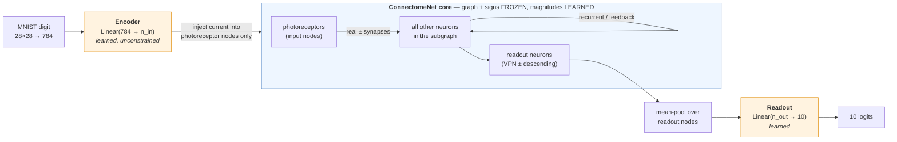
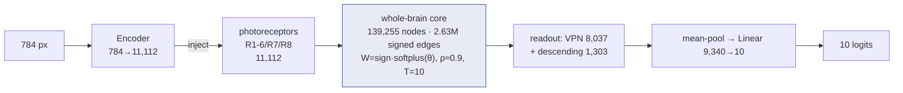
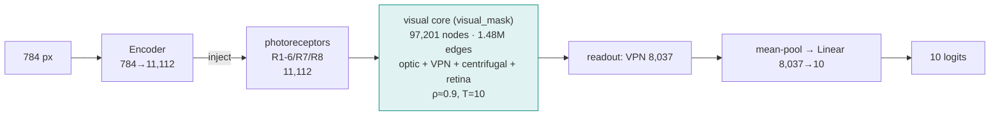
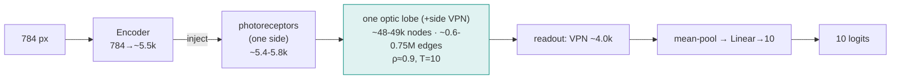
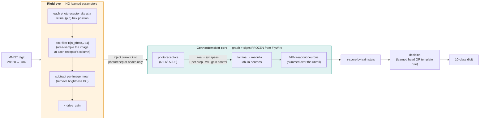

# Stage 3 — Per-model architectures + training/testing protocol

This is the detailed reference for the 24 connectome-constrained MNIST models. For the
conceptual overview see [`README.md`](README.md); for the headline results see
[`RESULTS.md`](RESULTS.md).

Every model shares one design — `Encoder → ConnectomeNet core → Readout` — and differs only
along three axes:

- **subgraph** (which neurons/edges form the core): 6 options
- **flavor** (how the core is unrolled): `ff_unroll` or `rnn`
- **init** (how edge magnitudes start): `from_data` or `random`

The **subgraph** sets the core's size and its input/readout populations; the **flavor** sets
the dynamics; the **init** sets only the starting weights (same architecture). So there are
**6 distinct architectures**, each run in 2 flavors × 2 inits = 24 trained models.

---

## Shared blueprint (all models)



- **Core weight (per edge e):** `W[e] = sign[e] · softplus(θ[e])`. `sign` and the edge set are
  fixed buffers from the connectome (Dale's law: training rescales magnitude, never flips
  sign). `θ` (one scalar per edge) is the **only** trainable parameter in the core.
- **Core update (T steps):** `h₀ = 0`; `h_{t+1} = (1−α)·h_t + α·tanh( Wᵀ·h_t  + x_t )`,
  implemented as a gather→`index_add` scatter (sparse; no dense N×N matrix).
- **Trainable params:** encoder `Linear(784→n_in)`, the core `θ` (= #edges), readout
  `Linear(n_out→10)`. Nothing else (no per-node bias/leak/gain — the "purest" variant).
- **Spectral init:** magnitudes are rescaled so the assembled sparse `W` has spectral radius
  **ρ ≈ 0.90** (sparse power iteration) for a stable unroll.

---

## The two flavors (dynamics)

Same core, same equations — only the leak `α` and when the image is injected differ:

```
  ff_unroll  (α = 1.0, inject at t=0 only)        rnn  (α = 0.2, inject every step)
  ─────────────────────────────────────────       ─────────────────────────────────────────
   x ─┐                                             x   x   x   x   x        (persistent)
      ▼                                             │   │   │   │   │
    [h0]→[h1]→[h2]→ … →[hT]                         ▼   ▼   ▼   ▼   ▼
          no input after t=0                       [h0]→[h1]→[h2]→…→[hT]
          read hT  →  readout                       leaky memory; read hT → readout
   "depth-T tied-weight feedforward sweep"          "recurrent net settling over T steps,
                                                      full BPTT through the unroll"
```

Both use **T = 10** steps here (≥ the max BFS hop-distance from photoreceptors to the readout
set, so the signal can reach the output before it is read).

---

## The six architectures (exact specs as run)

Numbers below are the *actual* values loaded from each model's `summary.json`. `n_params` =
total trainable (encoder + θ + readout); the core `θ` count equals `E`. All use `tanh`,
ρ≈0.90, T=10, `flyvis_standard` signs (ACh +1, GABA/Glu −1).

| # | subgraph | nodes N | edges E (=θ) | input (photoreceptors) | readout | BFS hops | params |
|---|---|---:|---:|---:|---:|---:|---:|
| 1 | `whole` | 139,255 | 2,630,012 | 11,112 | 9,340 (VPN 8,037 + desc 1,303) | 7 | 11.45 M |
| 2 | `whole_right` | 69,082 | 1,203,860 | 5,352 | 4,678 (VPN 4,029 + desc 649) | 6 | 5.45 M |
| 3 | `whole_left` | 69,943 | 1,051,651 | 5,760 | 4,654 (VPN 4,008 + desc 646) | 7 | 5.62 M |
| 4 | `optic` | 97,201 | 1,476,198 | 11,112 | 8,037 (VPN) | 5 | 10.28 M |
| 5 | `optic_right` | 48,114 | 754,751 | 5,352 | 4,029 (VPN) | 5 | 5.00 M |
| 6 | `optic_left` | 49,087 | 635,869 | 5,760 | 4,008 (VPN) | 5 | 5.20 M |

Input is always the photoreceptors (R1-6 + R7 + R8). Readout is visual-projection neurons for
the `optic*` models, and VPN **+** descending neurons for the `whole*` models (which contain
the descending pathway). `whole*` = full brain / one hemisphere; `optic*` = the stage-2
`visual_mask` union (optic + visual-projection + visual-centrifugal + photoreceptors).

### 1 · `whole` — whole brain (139,255 neurons)


The largest, most heterogeneous model — signal travels up to **7 hops** from retina to the
descending/VPN readout, through the entire central brain.

### 2 · `whole_right` / 3 · `whole_left` — single hemispheres (~69k neurons)


Same design as `whole`, restricted to neurons with `side == right` (or `left`). ~230 neurons
with no clean L/R side are excluded from both.

### 4 · `optic` — visual system (97,201 neurons)


The biologically "natural" image classifier: retina → lamina → medulla → lobula → VPN, only
**5 hops** retina→readout (shallower than whole-brain).

### 5 · `optic_right` / 6 · `optic_left` — visual hemispheres (~48-49k neurons)


The smallest and fastest models — a single optic lobe. `optic_right/rnn/random` was the **best
overall** run (97.75% test).

---

## How they were trained

Identical recipe for all 24 runs (overridable per config; none were overridden here).

**Data — MNIST** (`flyconn.models.data`, torchvision, cached to scratch
`…/v783/mnist`):
- 60,000 train images → **54,000 train / 6,000 validation** (10% holdout, `seed=0`).
- **10,000 test** images, used only for the final number.
- Each image normalized `(μ=0.1307, σ=0.3081)` and flattened to a 784-vector.
- Batch size **128**, shuffled, 4 dataloader workers.

**Optimization** (`flyconn.models.train`):
- Optimizer **Adam**, learning rate **1e-3**, over `{encoder, θ, readout}`.
- **CrossEntropyLoss** on the 10 logits.
- **Gradient clipping** at norm **1.0** (essential for the recurrent unroll stability).
- **Cosine-annealing** LR schedule over the run.
- **25 epochs**; the **best-validation** checkpoint is kept (`ckpt_best.pt`).
- Single precision (fp32); one model per GPU.

**Initialization (the experimental axis):**
- `from_data`: edge magnitude `tᵉ = α₀ · cᵉ / mean(c)` where `cᵉ` is the real synapse count
  (α₀=0.01); `θ = softplus⁻¹(t)`. The network starts as the (scaled) real wiring.
- `random`: keep the real edge set + signs, but draw magnitudes from a **log-normal fit** to
  the empirical counts (`t = exp(μ + σ·ε)`, ε∼𝒩(0,1)) — same amplitude *distribution*, random
  values. The control that isolates "does the specific data weight help?"
- Both then apply the ρ≈0.90 spectral rescale.

**What is frozen vs learned (every run):**
- Frozen: the edge set (connectivity mask), the per-edge sign, the leak α, the nonlinearity.
- Learned: encoder `Linear(784→n_in)`, core edge magnitudes `θ`, readout `Linear(n_out→10)`.

## How they were tested

- During training, **validation accuracy** (on the 6,000-image holdout) is logged every epoch
  to `metrics.jsonl`; the epoch with the highest val accuracy is checkpointed.
- After the final epoch, **test accuracy** is computed once on the held-out **10,000-image
  test set** with the model in eval mode (`summary.json` → `test_acc`, `best_val_acc`).
- `python -m flyconn.models.run aggregate` collates all runs into
  `…/v783/results/summary.csv` and a `from_data` vs `random` pivot.

## Compute

- Each run: **1× A100-80GB**, 8 CPUs, 64 GB RAM, on `pi_tpoggio` via SLURM.
- Wall-clock per run: **~47 min (smallest, `optic_left`) to ~4 h (largest, `whole`)**;
  median ~92 min. The 24-run grid ran as a SLURM array, up to 8 concurrent
  (`slurm/train_array.sbatch`, `--array=0-23%8`).
- Memory note: the connectome is stored as an **edge vector** (≤2.6M learnable floats); a
  dense 139k² weight matrix would be 78 GB and never fits — so all six models, including
  whole-brain, train comfortably on one GPU.

## Reproduce a single model

```bash
# build + inspect (CPU ok), then train one model on a GPU node
python -m flyconn.models.run build --config configs/experiments/optic_left_rnn_initB.yaml
EXP=optic_left_rnn_initB sbatch slurm/train.sbatch
```

---

# Stage 3++ — the faithful "rigid eye" models

The 24 models above use a **learned** `Linear(784 → n_photoreceptors)` encoder, so a large
part of the work (and the ~97% accuracy) is done by that MLP, not the connectome — tellingly,
the `random`-init core often *beats* `from_data`. The faithful-eye models remove that crutch:
the image enters the brain through a **rigid, non-learned filter** that renders it onto the
photoreceptors at their retinal-lattice positions (flyvis `BoxEye`-style area sampling),
exactly the way the fly's eye delivers it. The scientific question changes from "can we train a
network shaped like the connectome to classify MNIST?" to **"how much of the classification does
the measured *Drosophila* wiring do on its own?"**

Code: [`flyconn.models.eye`](../src/flyconn/models/eye.py) (the rigid eye),
[`flyconn.data_prep.retinotopy`](../src/flyconn/data_prep/retinotopy.py) (the retinal lattice),
`RigidEyeClassifier` + the gain-control additions in
[`connectome_net.py`](../src/flyconn/models/connectome_net.py), and the build/train/`fit_rigid`
wiring in [`train.py`](../src/flyconn/models/train.py) / [`run.py`](../src/flyconn/models/run.py).

---

## The shared pipeline (all three variants)



The pipeline is identical for V1/V2/V3 up to the **decision** box; what differs is *what is
learned*. The first three stages (eye → core dynamics → z-scored VPN readout) are described
once here; the per-variant differences are in the table further down.

### 1 · The rigid eye (`flyconn.models.eye`, no parameters)

The eye turns a 784-pixel image into an **external current vector** over the subgraph's nodes,
nonzero only at the photoreceptors. It is built once per subgraph as a frozen
`EyeMap`/`RigidEye`:

- **Retinal positions.** Each photoreceptor (`cell_type ∈ {R1-6, R7, R8}`) is placed on a 2D
  hex lattice by [`retinotopy.load_retinotopy`](../src/flyconn/data_prep/retinotopy.py).
  Source `columns` = the FlyWire-native per-`root_id` hex map (Codex *Visual Columns* /
  `hsseung/OpticLobe.jl`, fetched once by `retinotopy.fetch_visual_columns`); `pos_grid` =
  a self-contained lattice derived from each receptor's `pos_x/pos_y` anchor (PCA → hex bin,
  per eye); `auto` uses `columns` if it covers ≥80% of R1-6, else `pos_grid`.
- **Box-filter matrix `B[n_photo, 784]`.** For each receptor, the row is the area-overlap (tent)
  weight of the image pixels under its retinal column, **normalized to sum 1** — so a uniform
  image gives uniform column luminance. This is the flyvis `BoxEye` idea, precomputed so the
  forward is a single matmul `lum = pixels @ Bᵀ`.
- **Brightness removal + gain.** The per-image mean across receptors is subtracted (kills the
  global-brightness DC that a fixed-drive core would otherwise lock onto), then scaled by
  `drive_gain`. The result is written into the photoreceptor node currents; all other nodes are 0.
- **Knobs (config):** `eye_eyes` (`both` mirrors the image to both eyes with a horizontal flip
  for retinotopic handedness via `mirror_lr`; `left`/`right` ablations), `eye_channels`
  (`all` drives R1-6/R7/R8 with the same luminance — correct for grayscale — or `R1-6` only),
  `eye_fill` (`zero` = receptors with no column stay dark; `nearest` = borrow the closest column).

### 2 · The connectome core (`ConnectomeNet`, graph + signs frozen)

Same sparse leaky-integrator core as the 24 stage-3 models — `W[e] = sign[e]·softplus(θ[e])`,
edge set + signs fixed buffers, gather→`index_add` scatter (no dense N×N matrix). Two additions
make it usable **without a learned encoder/readout** (see "Gain control" below):

- **`state_norm: rms`** — after each unroll step the state `h` is renormalized to unit RMS
  (a gain-control / divisive-normalization step, biologically the optic lobe's job).
- **`readout_mode: accum`** — the readout is the **sum of the VPN activations over all T steps**,
  not just `h_T`. With a feedforward sweep each VPN neuron is maximally driven at its own
  BFS-hop timestep; accumulating captures the signal whenever it arrives.

The two biology fixes carried from the data:

- **Photoreceptor sign (`photoreceptor_sign`).** The FlyWire predicted-NT classifier has **no
  histamine class**, so photoreceptors are mislabeled ACh/Glut/GABA and ~956 are sign-0
  (dropped → inject no drive). Real photoreceptors are histaminergic and **inhibitory** onto
  L1/L2. `photoreceptor_sign: -1` (the `*_fix` runs) forces every photoreceptor-presynaptic
  edge to −1 at subgraph build and **restores the dropped edges** (e.g. `optic_left` E goes
  635,869 → 636,066). `inherit` (the `*_raw` runs) keeps the artifactual signs as a control.
- **Spectral init.** Edge magnitudes are `from_data` (∝ real synapse counts), then rescaled so
  the assembled `W` has spectral radius **ρ ≈ 0.90** for a stable unroll.

### 3 · The readout features

`feats = z-score( Σₜ h_t[VPN] )` — the per-step-summed activations of the biological readout
population (`super_class == visual_projection` for `optic*`; VPN + descending for `whole*`),
standardized by the **training-set** mean/std of each neuron. This `[n_readout]` vector
(e.g. 4,008 for `optic_left`) is what the decision stage consumes.

---

## The three variants — what is learned, how it trains, how it infers

| | **V1** core-learnable | **V2** frozen core + probe | **V3** fully rigid |
|---|---|---|---|
| Eye | rigid (no params) | rigid (no params) | rigid (no params) |
| Core θ (edge magnitudes) | **learned** (Dale-constrained) | **frozen** (`from_data`) | **frozen** (`from_data`) |
| Decision | learned `Linear(n_readout→10)` | learned `Linear(n_readout→10)` | **template rule, no params** |
| Trained by | gradient descent (`train`) | gradient descent (`train`) | one fit pass (`fit_rigid`) |
| Learned params | encoder=0, θ=#edges, head | encoder=0, θ=0, head only | **0** |
| Question it answers | does the rigid eye work as well as the learned one? | is class info *linearly present* in the frozen connectome's readout? | does the *measured wiring alone* separate the digits? |

### V1 — rigid eye, learnable Dale-constrained core, learned head

**Architecture.** `RigidEyeClassifier(decision="linear", learn_core=True)`. Only the readout
`Linear(n_readout→10)` and the core edge magnitudes `θ` are trainable; the eye has no
parameters and the connectivity + signs are frozen. Training can rescale a synapse's strength
but never flip its sign or create an edge (`W = sign·softplus(θ)`).

**Training.** Standard supervised loop (`flyconn.models.train.train`): Adam (lr 1e-3,
cosine-annealed), `CrossEntropyLoss` on the 10 logits, gradient clipping at norm 1.0, 25 epochs,
best-validation checkpoint. Backprop flows through the whole unroll (BPTT) into `θ` and the head;
the rigid eye is a fixed linear map so gradients pass through it but update nothing.

**Inference.** image → rigid eye → core unroll (with the *trained* `θ`) → z-scored VPN sum →
`argmax` of the learned linear head → digit.

### V2 — rigid eye, frozen core, learned linear probe

**Architecture.** `RigidEyeClassifier(decision="linear", learn_core=False)`. The core's `θ` is
set from `from_data`, spectral-rescaled, then **frozen** (`requires_grad=False`). Only the
readout `Linear(n_readout→10)` learns — a classic **linear probe** on a fixed representation.

**Training.** Same loop as V1, but the optimizer only sees the readout's ~`n_readout·10`
weights. Before training, the **feature standardization stats are computed once over the train
set** so the probe sees z-scored features (it doesn't waste capacity undoing the DC offset).
Fast — the expensive core forward is done with no autograd through `θ`.

**Inference.** image → rigid eye → core unroll (frozen `θ`) → z-scored VPN sum →
`argmax` of the learned probe → digit. The gap V2 − (V3 cosine) is "how much a learned linear
head adds over a fixed template on the *same* frozen features."

### V3 — fully rigid: zero learned parameters

**Architecture.** `RigidEyeClassifier(decision="ncm", learn_core=False, learn_readout=False)`.
Nothing is learned — not the eye, not the core, not the readout. Classification is by
**Nearest-Class-Mean (NCM) template matching** on the frozen connectome's readout.

**"Training" = one fit pass (`flyconn.models.train.fit_rigid`, no gradients).** Stream the
**training set once** through the frozen network and accumulate, per digit class, the mean
readout vector → 10 **class templates**. Also accumulate the global per-neuron mean/std (for
z-scoring). That's the entire fit: moments, not gradient descent.

**Inference (and the four reported numbers).** For a test image: rigid eye → frozen core →
readout vector, then classify by the nearest class template under a distance rule. V3 reports
three rules plus a control so the result can be trusted:

- **`raw-euclid`** — nearest template by Euclidean distance on the **raw** readout vector. This
  is the **brightness-artifact floor**: it partly classifies *how much ink* an image has
  (a "1" lights up fewer pixels than an "8"), so it can beat chance for a boring reason. Reported
  so the smarter rules can be checked against it.
- **`cosine`** — z-score each neuron, then classify by **cosine similarity** (the *angle*, which
  ignores overall magnitude) to each template. This measures the *pattern* of activity, not
  brightness. **This is the headline V3 number.**
- **`lda`** — nearest template in the z-scored space (Euclidean after standardization). The
  closed-form, zero-learning diagonal-covariance LDA / Mahalanobis nearest-mean.
- **`shuffle`** (control) — re-fit the cosine templates on **shuffled** training labels and
  re-evaluate. A correct pipeline **must collapse this toward chance (~10%)**; a high value would
  signal a leak. (It sits slightly above 10% because the brightness floor leaks even through
  random templates — expected and harmless.)

**Credibility rule:** a V3 result counts only if `cosine`/`lda` **clearly exceed** `raw-euclid`
(it's pattern, not brightness) **and** `shuffle` collapses to ~chance (no leakage).

---

## Gain control — why a frozen core needs it (a real finding from this work)

The first thing that went wrong: with **no** learned encoder/readout, a frozen ρ≈0.9 `tanh`
core decays the injected signal geometrically across hops, so by the time it reaches the VPN
readout (median 3, max 5 hops in `optic_left`) the image-driven variation is **≈1e-6** — the
readout is effectively dead, and every digit looks identical. The learned-encoder stage-3
models hid this because the encoder produced whatever scale was needed and the learned readout
amplified tiny signals; the rigid/frozen setting exposes it.

The fix (now auto-enabled for the rigid eye, both off for the learned models): **per-step RMS
state normalization** keeps the activations at a usable scale across all hops, and the
**whole-trajectory accumulated readout** captures each VPN neuron's signal at the hop it
arrives. Measured effect on `optic_left`: readout across-image std **9.6e-7 → 1.06**, a ~10⁶×
restoration — and exactly what turns V3 from "10% / chance" into the results below.

---

## Results so far (Phase 1)

Phase 1 = the cheapest, most-informative slice: variants {V1, V2, V3} × subgraphs
{`optic_left`, `optic_right`} × photoreceptor sign {`raw` = artifactual NT, `fix` = histaminergic
−1}, all `ff_unroll`, `from_data`, `pos_grid` retinotopy (the FlyWire-native `columns` hex map
not yet fetched). Run on `pi_tpoggio` A100s via [`slurm/eye_array.sbatch`](../slurm/eye_array.sbatch)
(job array 15727099). MNIST: 54k train / 6k val / 10k test, as for stage 3.

**V3 — zero learned parameters, full 10k test set:**

| run | cosine-NCM | raw-euclid (floor) | LDA | shuffle ctrl | chance |
|---|---:|---:|---:|---:|---:|
| `optic_left_V3_fix` (sign −1) | **0.574** | 0.508 | 0.567 | 0.200 | 0.10 |
| `optic_left_V3_raw` (raw NT) | **0.603** | 0.552 | 0.607 | 0.142 | 0.10 |

Both clear chance decisively, `cosine`/`lda` ≫ `raw-euclid` (it's pattern, not brightness), and
the shuffle controls collapse toward chance — so **the as-measured *Drosophila* connectome, with
zero learned parameters, classifies MNIST digits at ~57–60%.**

**V2 — frozen core + learned linear probe, test accuracy:**

| run | test acc | best val |
|---|---:|---:|
| `optic_left_V2_fix` (sign −1) | **0.939** | 0.939 |
| `optic_left_V2_raw` (raw NT) | **0.935** | 0.938 |

A single linear probe on the **frozen** connectome's readout reaches ~94% — i.e. the class
information is strongly, *linearly* present in the fixed wiring's output; the connectome is doing
real feature extraction, not just passing noise to a powerful head.

**V1 — learnable Dale-constrained core (still running at time of writing):** `optic_left_V1_fix`
is climbing past ~94% validation by epoch ~4 of 25; the `optic_right` runs and the full per-run
table land via `python -m flyconn.models.run aggregate` → `…/v783/results/summary.csv` (now
carrying `variant`, `decision`, `photoreceptor_sign`, and the three V3 NCM columns).

**Early reading.** The headline is V2/V3: a fixed connectome already separates the digits (V3
~57–60% with *no* learning; V2 ~94% with only a linear probe). One genuine subtlety — for the
zero-learning template (V3), the **artifactual `raw` signs slightly beat the biologically-correct
`fix`** (60.3% vs 57.4%); the histamine fix changes the readout geometry in a way the bare
nearest-mean rule doesn't prefer. Whether that flips once the core is *trained* (V1) is exactly
what Phase 1's V1 runs test.

---

## Run them

```bash
# generate the phase-1 (cheapest, most-informative) leaf configs (10 of them)
python -m flyconn.models.run eye_grid                 # -> configs/eye_experiments/*.yaml

# one model at a time: V1/V2 train by gradient descent; V3 is a single fit pass (no training)
python -m flyconn.models.run train     --config configs/eye_experiments/optic_left_V2_fix.yaml
python -m flyconn.models.run fit_rigid --config configs/eye_experiments/optic_left_V3_fix.yaml

# the whole phase-1 grid on SLURM (each config's `stage:` field routes train vs fit_rigid)
sbatch slurm/eye_array.sbatch
python -m flyconn.models.run aggregate                # collate; adds variant/decision/sign cols
```

`eye_grid --full` expands to all variants × all six subgraphs × {sign inherit, −1} (Phase 2 —
adds `optic` both-eyes and the whole-brain subgraphs, where the signal can reach descending
neurons). The faithful-eye unit tests live in [`tests/test_eye.py`](../tests/test_eye.py)
(box-filter determinism/normalization, coverage/fill, eye routing + LR mirror, sign override,
frozen-core); `python -m pytest tests/ -q` → 28 passing.
