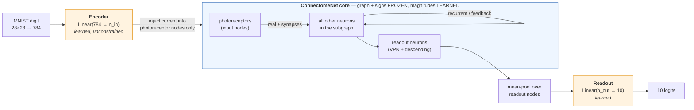
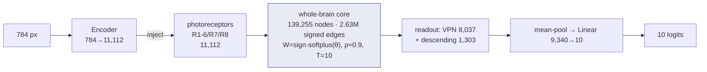
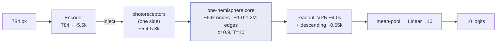
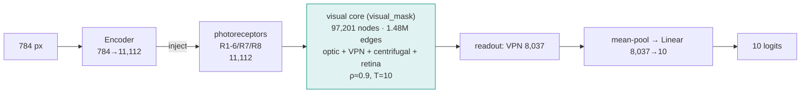
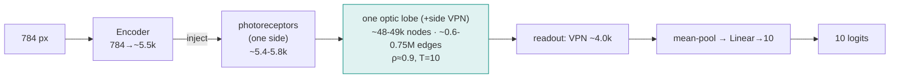

# Stage 3 — Per-model architectures + training/testing protocol

This is the detailed reference for the 24 connectome-constrained MNIST models. For the
conceptual overview see [`README.md`](README.md); for the headline results see
[`RESULTS.md`](RESULTS.md).

Every model shares one design — `Encoder → ConnectomeNet core → Readout` — and differs only
along three axes:

- **subgraph** (which neurons/edges form the core): 6 options
- **flavor** (how the core is unrolled): `ff_unroll` or `rnn`
- **init** (how edge magnitudes start): `from_data` or `random`

The **subgraph** sets the core's size and its input/readout populations; the **flavor** sets
the dynamics; the **init** sets only the starting weights (same architecture). So there are
**6 distinct architectures**, each run in 2 flavors × 2 inits = 24 trained models.

---

## Shared blueprint (all models)



- **Core weight (per edge e):** `W[e] = sign[e] · softplus(θ[e])`. `sign` and the edge set are
  fixed buffers from the connectome (Dale's law: training rescales magnitude, never flips
  sign). `θ` (one scalar per edge) is the **only** trainable parameter in the core.
- **Core update (T steps):** `h₀ = 0`; `h_{t+1} = (1−α)·h_t + α·tanh( Wᵀ·h_t  + x_t )`,
  implemented as a gather→`index_add` scatter (sparse; no dense N×N matrix).
- **Trainable params:** encoder `Linear(784→n_in)`, the core `θ` (= #edges), readout
  `Linear(n_out→10)`. Nothing else (no per-node bias/leak/gain — the "purest" variant).
- **Spectral init:** magnitudes are rescaled so the assembled sparse `W` has spectral radius
  **ρ ≈ 0.90** (sparse power iteration) for a stable unroll.

---

## The two flavors (dynamics)

Same core, same equations — only the leak `α` and when the image is injected differ:

```
  ff_unroll  (α = 1.0, inject at t=0 only)        rnn  (α = 0.2, inject every step)
  ─────────────────────────────────────────       ─────────────────────────────────────────
   x ─┐                                             x   x   x   x   x        (persistent)
      ▼                                             │   │   │   │   │
    [h0]→[h1]→[h2]→ … →[hT]                         ▼   ▼   ▼   ▼   ▼
          no input after t=0                       [h0]→[h1]→[h2]→…→[hT]
          read hT  →  readout                       leaky memory; read hT → readout
   "depth-T tied-weight feedforward sweep"          "recurrent net settling over T steps,
                                                      full BPTT through the unroll"
```

Both use **T = 10** steps here (≥ the max BFS hop-distance from photoreceptors to the readout
set, so the signal can reach the output before it is read).

---

## The six architectures (exact specs as run)

Numbers below are the *actual* values loaded from each model's `summary.json`. `n_params` =
total trainable (encoder + θ + readout); the core `θ` count equals `E`. All use `tanh`,
ρ≈0.90, T=10, `flyvis_standard` signs (ACh +1, GABA/Glu −1).

| # | subgraph | nodes N | edges E (=θ) | input (photoreceptors) | readout | BFS hops | params |
|---|---|---:|---:|---:|---:|---:|---:|
| 1 | `whole` | 139,255 | 2,630,012 | 11,112 | 9,340 (VPN 8,037 + desc 1,303) | 7 | 11.45 M |
| 2 | `whole_right` | 69,082 | 1,203,860 | 5,352 | 4,678 (VPN 4,029 + desc 649) | 6 | 5.45 M |
| 3 | `whole_left` | 69,943 | 1,051,651 | 5,760 | 4,654 (VPN 4,008 + desc 646) | 7 | 5.62 M |
| 4 | `optic` | 97,201 | 1,476,198 | 11,112 | 8,037 (VPN) | 5 | 10.28 M |
| 5 | `optic_right` | 48,114 | 754,751 | 5,352 | 4,029 (VPN) | 5 | 5.00 M |
| 6 | `optic_left` | 49,087 | 635,869 | 5,760 | 4,008 (VPN) | 5 | 5.20 M |

Input is always the photoreceptors (R1-6 + R7 + R8). Readout is visual-projection neurons for
the `optic*` models, and VPN **+** descending neurons for the `whole*` models (which contain
the descending pathway). `whole*` = full brain / one hemisphere; `optic*` = the stage-2
`visual_mask` union (optic + visual-projection + visual-centrifugal + photoreceptors).

### 1 · `whole` — whole brain (139,255 neurons)


The largest, most heterogeneous model — signal travels up to **7 hops** from retina to the
descending/VPN readout, through the entire central brain.

### 2 · `whole_right` / 3 · `whole_left` — single hemispheres (~69k neurons)


Same design as `whole`, restricted to neurons with `side == right` (or `left`). ~230 neurons
with no clean L/R side are excluded from both.

### 4 · `optic` — visual system (97,201 neurons)


The biologically "natural" image classifier: retina → lamina → medulla → lobula → VPN, only
**5 hops** retina→readout (shallower than whole-brain).

### 5 · `optic_right` / 6 · `optic_left` — visual hemispheres (~48-49k neurons)


The smallest and fastest models — a single optic lobe. `optic_right/rnn/random` was the **best
overall** run (97.75% test).

---

## How they were trained

Identical recipe for all 24 runs (overridable per config; none were overridden here).

**Data — MNIST** (`flyconn.models.data`, torchvision, cached to scratch
`…/v783/mnist`):
- 60,000 train images → **54,000 train / 6,000 validation** (10% holdout, `seed=0`).
- **10,000 test** images, used only for the final number.
- Each image normalized `(μ=0.1307, σ=0.3081)` and flattened to a 784-vector.
- Batch size **128**, shuffled, 4 dataloader workers.

**Optimization** (`flyconn.models.train`):
- Optimizer **Adam**, learning rate **1e-3**, over `{encoder, θ, readout}`.
- **CrossEntropyLoss** on the 10 logits.
- **Gradient clipping** at norm **1.0** (essential for the recurrent unroll stability).
- **Cosine-annealing** LR schedule over the run.
- **25 epochs**; the **best-validation** checkpoint is kept (`ckpt_best.pt`).
- Single precision (fp32); one model per GPU.

**Initialization (the experimental axis):**
- `from_data`: edge magnitude `tᵉ = α₀ · cᵉ / mean(c)` where `cᵉ` is the real synapse count
  (α₀=0.01); `θ = softplus⁻¹(t)`. The network starts as the (scaled) real wiring.
- `random`: keep the real edge set + signs, but draw magnitudes from a **log-normal fit** to
  the empirical counts (`t = exp(μ + σ·ε)`, ε∼𝒩(0,1)) — same amplitude *distribution*, random
  values. The control that isolates "does the specific data weight help?"
- Both then apply the ρ≈0.90 spectral rescale.

**What is frozen vs learned (every run):**
- Frozen: the edge set (connectivity mask), the per-edge sign, the leak α, the nonlinearity.
- Learned: encoder `Linear(784→n_in)`, core edge magnitudes `θ`, readout `Linear(n_out→10)`.

## How they were tested

- During training, **validation accuracy** (on the 6,000-image holdout) is logged every epoch
  to `metrics.jsonl`; the epoch with the highest val accuracy is checkpointed.
- After the final epoch, **test accuracy** is computed once on the held-out **10,000-image
  test set** with the model in eval mode (`summary.json` → `test_acc`, `best_val_acc`).
- `python -m flyconn.models.run aggregate` collates all runs into
  `…/v783/results/summary.csv` and a `from_data` vs `random` pivot.

## Compute

- Each run: **1× A100-80GB**, 8 CPUs, 64 GB RAM, on `pi_tpoggio` via SLURM.
- Wall-clock per run: **~47 min (smallest, `optic_left`) to ~4 h (largest, `whole`)**;
  median ~92 min. The 24-run grid ran as a SLURM array, up to 8 concurrent
  (`slurm/train_array.sbatch`, `--array=0-23%8`).
- Memory note: the connectome is stored as an **edge vector** (≤2.6M learnable floats); a
  dense 139k² weight matrix would be 78 GB and never fits — so all six models, including
  whole-brain, train comfortably on one GPU.

## Reproduce a single model

```bash
# build + inspect (CPU ok), then train one model on a GPU node
python -m flyconn.models.run build --config configs/experiments/optic_left_rnn_initB.yaml
EXP=optic_left_rnn_initB sbatch slurm/train.sbatch
```
