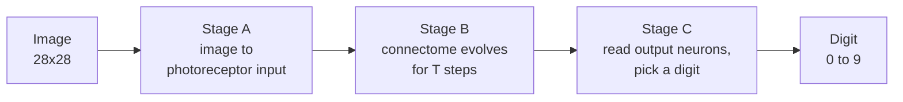
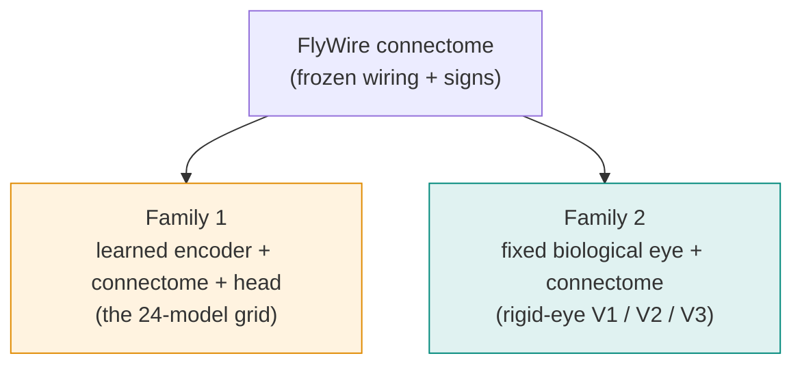
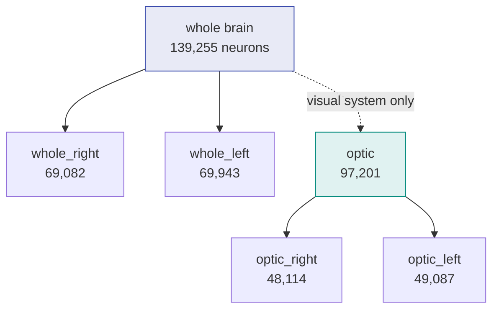

# 3: Modeling

This stage turns the real *Drosophila* connectome into networks that classify
[MNIST](http://yann.lecun.com/exdb/mnist/) digits, and asks how much of the work the fly's actual
wiring does. The connectivity (which neurons connect) and the synapse signs
(excitatory or inhibitory) are **fixed from the data**; what varies is how the image gets in and
how much else is learned.

This page is the short tour. The full reference, with every diagram, the training and inference
details, the results, and what they imply, is in [`MODELS.md`](MODELS.md). The headline accuracy
tables are in [`RESULTS.md`](RESULTS.md). The code is in [`flyconn.models`](../src/flyconn/models/).

## The idea in one picture

An image is delivered to the fly's photoreceptors, the connectome evolves under its own recurrent
dynamics for a few steps, and a biological output population is read out into a digit.



Two design rules keep the model honest:

- The image enters **only at the photoreceptors** (R1-6, R7, R8), the real entry point for vision.
- The decision reads **only a biological output population** (the visual projection neurons that
  leave the optic lobe, plus descending neurons for whole-brain models).

If we let the input write to every neuron or the readout read from every neuron, the model would
collapse into an ordinary neural network wearing the connectome as decoration, and we could not
tell whether the wiring matters.

## The core neuron model

Each neuron is one continuous activation value (a rate unit, not a spiking model). At each step it
sums the signed input from its presynaptic partners, adds any injected image current, and passes
the total through `tanh`. The whole network updates as:

```
h(t+1) = (1 - alpha) * h(t) + alpha * tanh( W * h(t) + x(t) )
```

`h` is all neuron activations, `W` is the signed and weighted connectome, `x(t)` is the injected
image, and `alpha` is a fixed leak. Each synapse's **sign** comes from the presynaptic
neurotransmitter ([Dale's principle](https://en.wikipedia.org/wiki/Dale%27s_principle):
acetylcholine excitatory, GABA and glutamate inhibitory) and is **frozen**. Each synapse's
**magnitude** is a single number that can be learned, but because the sign is a fixed multiplier on
a non-negative magnitude, training can rescale a synapse and **never flip its sign**.

## Two families of models



**Family 1 (the original 24 models)** uses a learned `Linear(784, photoreceptors)` encoder for the
input and a learned linear head for the output, with the connectome in between. These show that a
connectome-shaped network can solve MNIST (all 24 reach about 97%). But a learned encoder plus a
learned head is itself a capable network, so this number does not isolate the connectome's own
contribution.

**Family 2 (the rigid-eye models)** replaces the learned encoder with a **fixed, eye-like filter**
that delivers the image to the photoreceptors the way a real eye would (each photoreceptor reads
the local brightness at its position on a hexagonal retinal grid, similar to
[flyvis](https://github.com/TuragaLab/flyvis)). It then sweeps how much else is learned:

- **V1:** train the connectome's edge magnitudes plus a small head.
- **V2:** freeze the connectome, train only a linear probe (is the digit *linearly* readable from
  the fixed wiring?).
- **V3:** freeze everything and classify by nearest class template, with **zero learned
  parameters** (does the wiring alone separate the digits?).

## What we found

As learning is stripped away, the measured connectome keeps classifying:

| What is learned | MNIST accuracy |
|---|---|
| V1: connectome magnitudes + head | about 96% |
| V2: only a linear probe (connectome frozen) | about 94% |
| V3: nothing at all | about 50 to 60% (chance is 10%) |

The clean ladder shows the signal is genuinely in the fixed wiring, not supplied by a learned
input or output stage. Even with no learning at all, the fly's visual connectome classifies digits
five to six times better than chance. Full numbers and interpretation are in
[`MODELS.md`](MODELS.md) and [`RESULTS.md`](RESULTS.md).

## Subgraphs

Most experiments run on a sub-network rather than the whole brain. `optic*` subgraphs are the
visual system (they contain the photoreceptors); `whole*` are the full brain or one hemisphere.



## Run it

Everything runs through `sbatch` on `pi_tpoggio` (one A100 per model), never the login node.
Training uses the `consortium` conda environment.

```bash
cd "/orcd/data/tpoggio/001/mabdel03/Connectomics"

# Family 1: the 24-model grid
python -m flyconn.models.run grid                  # write the 24 configs
sbatch slurm/train_array.sbatch                    # run them

# Family 2: the rigid-eye models
python -m flyconn.models.run eye_grid              # write the Phase-1 configs
sbatch slurm/eye_array.sbatch                      # run them (V1/V2 train, V3 is one fit pass)

# collate results
python -m flyconn.models.run aggregate
```

Per-run outputs land on scratch under `…/v783/models/<run>/`
(`ckpt_best.pt`, `metrics.jsonl`, `summary.json`); the combined table is
`…/v783/results/summary.csv`.

## Code map

- [`subgraphs.py`](../src/flyconn/models/subgraphs.py): the six subgraph selectors, the edge
  buffers, and the photoreceptor sign correction.
- [`connectome_net.py`](../src/flyconn/models/connectome_net.py): the recurrent core and the two
  classifiers (learned-encoder and rigid-eye).
- [`eye.py`](../src/flyconn/models/eye.py): the fixed biological eye.
- [`retinotopy.py`](../src/flyconn/data_prep/retinotopy.py): the retinal hex map.
- [`init_modes.py`](../src/flyconn/models/init_modes.py): the `from_data` and `random`
  initializations.
- [`io_inject.py`](../src/flyconn/models/io_inject.py): input and output neuron selection plus the
  hop-distance guard.
- [`train.py`](../src/flyconn/models/train.py), [`run.py`](../src/flyconn/models/run.py): training,
  the zero-learning fit, and the command-line interface.

## References

- FlyWire connectivity: Dorkenwald et al. 2024, [*Neuronal wiring diagram of an adult brain*](https://www.nature.com/articles/s41586-024-07558-y) (*Nature*).
- FlyWire annotations: Schlegel et al. 2024, [*Whole-brain annotation and multi-connectome cell typing of Drosophila*](https://www.nature.com/articles/s41586-024-07686-5) (*Nature*).
- Connectome-constrained vision: Lappalainen et al. 2024, [*Connectome-constrained networks predict neural activity across the fly visual system*](https://www.nature.com/articles/s41586-024-07939-3) (*Nature*).
- Sign-constrained recurrent networks: Song et al. 2016, [*Training Excitatory-Inhibitory Recurrent Neural Networks*](https://journals.plos.org/ploscompbiol/article?id=10.1371/journal.pcbi.1004792) (*PLoS Comput Biol*).
