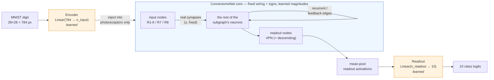
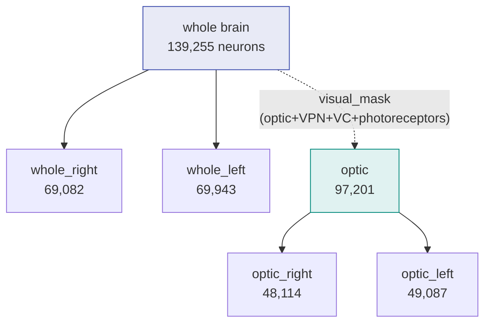

# 3 — Modeling

Connectome-constrained **trainable** feedforward / RNN networks that classify **MNIST**.
The real **connectivity (which edges exist) and synaptic signs (excitatory/inhibitory from
neurotransmitter) are FIXED from the data**; only the **edge magnitudes** are learned (plus
a small MNIST input encoder and a linear readout). Code lives in
[`flyconn.models`](../src/flyconn/models/); this dir holds the notebook + launchers.

## Architecture

### Overall data flow

A 28×28 MNIST digit is encoded into a current that is injected **only into the
photoreceptor neurons** of a fly-brain subgraph. The connectome core then evolves for `T`
steps under its own (sign-constrained) recurrent dynamics. Finally a linear head reads the
activations of a **biological output population** (visual-projection / descending neurons)
and produces 10 class logits.



Orange = the only two *unconstrained* learned modules (input encoder, output head). Blue =
the connectome core, whose **graph and signs are frozen from the data** and whose only
trainable degrees of freedom are the per-edge magnitudes. Restricting injection and readout
to small biological populations is deliberate: a 784→all-nodes encoder or all-nodes readout
would turn the model into a disguised MLP and hide whether the *wiring* does the work.

### The core neuron model

Each node is a single **leaky rate unit** (no spikes). Every real synapse `i→j` contributes a
signed, magnitude-learnable weight; the node sums its inputs, adds the external current, and
passes the result through `tanh`. The whole network is unrolled for `T` steps:

```
            external current x_t (from the encoder, into input nodes only)
                                  │
  h_t  ──gather pre──►  Σ_e  sign[e]·softplus(θ[e]) · h_t[pre(e)]  ──scatter to post──►  inp
  (state at step t)         └─ signed synaptic drive over all real edges ─┘                │
                                                                                           ▼
                         h_{t+1} = (1−α)·h_t  +  α·tanh( inp + x_t )
                                    └ leak ┘        └ updated activation ┘
```

- `sign[e] ∈ {+1, −1}` — **fixed** from the presynaptic neurotransmitter (Dale's law). ACh
  excitatory; GABA & glutamate inhibitory (Glu is inhibitory in flies).
- `softplus(θ[e]) ≥ 0` — the **learned** magnitude. Because the sign is a fixed multiplier on
  a non-negative term, training can only *rescale* a synapse, **never flip its sign**.
- `α` — fixed leak (no learned per-node parameters in this "purest" variant).
- the sparse `Σ_e … h[pre]` is done by **gather → `index_add` scatter** over the edge list,
  *not* `torch.sparse_csr_tensor` (whose autograd is broken, pytorch #98929).

### Feedforward vs. RNN — same equations, different unroll

The connectome is a graph **with cycles**, so a literal single-pass feedforward net doesn't
exist without deleting edges. Both flavors are therefore unrolls of the *same* dynamics; they
differ only in leak and when the image is injected:

```
ff_unroll                                  rnn
─────────                                  ───
inject x at t=0 only                       inject x at EVERY step (persistent)
α ≈ 1  (no memory carry)                    α < 1  (leaky memory)
read at step T                              read at step T, full BPTT
"a depth-T tied-weight feedforward sweep"  "a recurrent network settling over T steps"

 x→[h0]→[h1]→[h2]→ … →[hT]→readout          x�‖   x‖   x‖        x‖
        (one input pulse propagates)        [h0]→[h1]→[h2]→ … →[hT]→readout
                                            (input drives every step; feedback integrated)
```

`T` defaults to `max(10, BFS hop-distance from photoreceptors to the readout set)` so the
signal can actually reach the output neurons before it is read (a BFS guard asserts this).

### Weight parametrization (what is frozen vs learned)

```
   real synapse i→j ──►  edge e in the buffers
   ┌─────────────────────────────────────────────────────────────────┐
   │  row_idx[e] = post(j)   ┐                                          │
   │  col_idx[e] = pre(i)    ├─ FIXED buffers (connectivity "mask")     │
   │  sign[e]    = ±1        ┘   transposed to W[post, pre]             │
   │                                                                    │
   │  θ[e]  ── LEARNED ──►  W_value[e] = sign[e] · softplus(θ[e])       │
   └─────────────────────────────────────────────────────────────────┘
   Absent synapses simply have no edge → structurally zero gradient (the mask is implicit;
   no dense N×N matrix is ever formed — a dense 139k² would be 78 GB).
```

### The six subgraphs (concrete sizes)

Each subgraph is an induced sub-network of the whole connectome. `optic*` use the stage-2
`visual_mask` (so they contain the photoreceptors that receive the image); `whole*` are the
full brain or one hemisphere. Input = photoreceptors; readout = visual-projection (+ descending
for whole-brain). `hops` = max BFS distance input→readout; `T` = unroll length used.

| subgraph | nodes (N) | edges (E) | input nodes | readout nodes | hops | T |
|---|---:|---:|---:|---:|---:|---:|
| `whole` | 139,255 | 2,630,012 | 11,112 | 9,340 | 7 | 10 |
| `whole_right` | 69,082 | 1,203,860 | 5,352 | 4,678 | 6 | 10 |
| `whole_left` | 69,943 | 1,051,651 | 5,760 | 4,654 | 7 | 10 |
| `optic` | 97,201 | 1,476,198 | 11,112 | 8,037 | 5 | 10 |
| `optic_right` | 48,114 | 754,751 | 5,352 | 4,029 | 5 | 10 |
| `optic_left` | 49,087 | 635,869 | 5,760 | 4,008 | 5 | 10 |



Each of these 6 subgraphs × {`ff_unroll`, `rnn`} × {`from_data`, `random`} init = the 24-run
grid below.

## The experiment grid (6 × 2 × 2 = 24 runs)

| axis | values |
|---|---|
| subgraph | `whole`, `whole_right`, `whole_left`, `optic`, `optic_right`, `optic_left` |
| flavor | `ff_unroll` (inject at t=0, leak≈1), `rnn` (persistent inject, leaky, BPTT) |
| init | `from_data` (magnitudes = scaled real synapse counts), `random` (log-normal matched amplitude) |

The `optic*` subgraphs use the stage-2 `visual_mask` union (optic + visual_projection +
visual_centrifugal + photoreceptors), so MNIST enters through real photoreceptors (R1-6/R7/R8).

**Headline question:** does the real wiring (`from_data`) beat amplitude-matched random
wiring (`random`), and across which subgraphs/flavors?

## Implementation notes (`connectome_net.py`)

The Architecture section above is the conceptual picture; the non-obvious implementation
choices that make it correct and tractable:

- **Sparse, never dense.** A dense 139k² weight matrix is 78 GB — infeasible. Everything is
  an **edge vector** (≤2.6M learnable floats); the forward `W @ h` is a gather→`index_add`
  scatter over the edge list.
- **Autograd trap avoided.** We do *not* build the weight as a `torch.sparse_csr_tensor` —
  its autograd is broken ([pytorch #98929](https://github.com/pytorch/pytorch/issues/98929))
  and would silently zero the gradient to `theta`. The scatter path keeps gradients flowing.
- **Orientation.** Stored adjacency is source-major `A[i,j]=i→j`; `build_subgraph` transposes
  to `W[post,pre]` so `h_post = W @ h_pre` is correct.
- **Stability with no learned node params.** Magnitudes are rescaled at init so the assembled
  sparse `W` has spectral radius ≈0.9 (sparse power iteration, never densified); plus `tanh`,
  fixed leak, and grad-clip keep the `T`-step unroll bounded.
- **Code map:** [`subgraphs.py`](../src/flyconn/models/subgraphs.py) (the 6 selectors →
  edge buffers), [`connectome_net.py`](../src/flyconn/models/connectome_net.py) (the core +
  classifier), [`init_modes.py`](../src/flyconn/models/init_modes.py) (from_data / random),
  [`io_inject.py`](../src/flyconn/models/io_inject.py) (input/readout sets + BFS guard),
  [`train.py`](../src/flyconn/models/train.py), [`run.py`](../src/flyconn/models/run.py).

The four invariants (gradient reaches `theta`, sign never flips, mask fixed, signal flows
pre→post) are guarded by [`tests/test_models.py`](../tests/test_models.py).

## Environment / run

Training uses the **`consortium`** env (torch 2.3.1+cu121 + torchvision + flyconn). Everything
runs via `sbatch` on `pi_tpoggio` (1× A100) — **never the login node**. Artifacts go to scratch
(`$FLYCONN_DATA_ROOT/v783/{mnist,models,results}`).

```bash
cd "/orcd/data/tpoggio/001/mabdel03/Connectomics"

# single run
EXP=optic_left_ff_unroll_initA sbatch slurm/train.sbatch
# smoke (1 epoch):  STAGE=smoke EXP=... sbatch slurm/train.sbatch

# full 24-run grid (<=4 concurrent A100s)
cd "3 - Modeling" && ./03_train.sh        # = sbatch ../slurm/train_array.sbatch

# interactive build + inspection + short smoke train
#   open modeling.ipynb with the Python (consortium) kernel (use a GPU node for the smoke train)
```

Per-run outputs: `…/models/<subgraph>_<arch>_<init>/{ckpt_best.pt, metrics.jsonl, summary.json,
config_resolved.json}`.

## CLI

```bash
python -m flyconn.models.run grid                       # (re)generate the 24 leaf configs
python -m flyconn.models.run build --config <leaf.yaml> # construct + print model info, no train
python -m flyconn.models.run train --config <leaf.yaml> # full training run
```

Reference: flyvis (Lappalainen 2024, connectome-constrained DMN), Song et al. 2016
(excitatory-inhibitory RNN sign constraints).
