# Architecture

## Scientific and runtime boundaries

```mermaid
flowchart LR
    V[Analytic 1-D scene] --> VR[Test panoramic retina]
    VR --> S[Reichardt + reduced<br/>NOD1 surrogate]
    FB[Current body yaw/rate] --> G[Body-coupled figure/world control]
    G -->|5 ms| GC[Live registered fly-FGS<br/>T4a / LLPC1 / vCH / DCH]
    GC --> GN[Four exact NOD1 voltages]
    GC -. exact 1,684-cell + retinal state<br/>digest-bound display only .-> D
    X[External legacy visual circuit] -. source retinal frames unavailable .-> C
    C[Frozen NOD1 result<br/>individual voltages] --> I[Strict SI/identity importer]
    S --> B
    GN -->|availability receipt| B
    I --> B[Streaming NOD1 -> contralateral DNp26<br/>0.5 ms causal encoder]
    E[Evidence graph<br/>FAFB 783 + MANC 1.0 seed] -. topology and provenance .-> B
    Q[External empirical archives] --> P[Fail-closed intake +<br/>content-addressed protocols]
    B --> N[DNp26 -> ipsilateral<br/>iv2/i1/iv1/b3 MNs]
    N -->|seeded phase-gated events| M[0.1 ms natural + effective<br/>individual muscle state]
    N -->|rate: visibly inferred timing| M
    P -. only reviewed calibration receipts .-> M
    M --> H[VirtualWingHinge<br/>force-stage interventions]
    P -. only reviewed calibration receipts .-> H
    H --> T[raw-lane six-axis generalized wing torque]
    T --> L[Explicit raw-L/R to physical-wing hypothesis]
    L --> R[Reduced-order NumPy<br/>quasi-steady aero + 6-DoF]
    L --> F[Pinned FlyGym/FlyBody<br/>MuJoCo 3.9.x at 0.1 ms]
    F --> FB
    R --> A[Hashed SI artifacts]
    F --> A
    A --> D[Decimated replay JSON]
    D --> W[Static Three.js client]
```



There are two physics paths, and their outputs must never be conflated:

1. The dependency-light NumPy path is deterministic and useful for integration and regression tests. It is an uncalibrated reduced-order scaffold.
2. The FlyGym path executes the actual articulated FlyBody MuJoCo model. `FlightEpisodeRunner`, `simulate-fly-fgs-fixture`, `simulate-nod1`, and `simulate-retinal` can select it through the external-physics interface and pass muscle-derived six-axis wing torques to it. The canonical fly-FGS, analytic-retinal, and historical registered-Chromium vertical slices plus separate adapter/convergence cases exercise this boundary on the pinned worker. Physics-rate actuator torque, root-total fluid wrench, measured wing qpos/qvel, transition-contact counts, root/thorax state, and articulated whole-fly center of mass cross the boundary as distinct quantities. Released flight baselines and neuromuscular parameters have not been validated, and no reviewed per-wing fluid-wrench decomposition is exposed.

The public AWS route is a third, display-only runtime. It consumes static
artifacts and never imports MuJoCo or runs simulation for an HTTP request.
Historical v10/v11 fixture catalogs remain useful regression records, but none
of their report, registry, image, or manifest receipts is current for source
registry v1.18.0. A current release must be regenerated from the canonical
online artifacts and final complete-worker report.

There are four retained open-loop causal vertical slices plus the preferred
canonical online path. `simulate-nod1` begins with a saved
legacy NOD1 voltage result and therefore cannot recover its source retinal
frames. `simulate-retinal` begins with finite-exposure samples from an analytic
one-dimensional scene and runs a minimal image-derived motion/NOD1 surrogate.
The second path proves that stage boundaries, clocks, provenance, and mechanics
can execute from normalized image samples to body state; it does not reproduce the full T4/T5,
vCH/DCH, or 1,208-cell NOD1 circuit and cannot establish biological accuracy.
The historical third path consumes the exact four registered voltage readouts from a real
Chromium execution of the frozen 1,208-cell circuit: 100 samples at 5 ms across
the complete 0.5 s fixture, with 5,188 directed aggregate edges and 53,715
prepared events locked by the fixture receipt. It then executes the same causal
DN/VNC, MN, muscle, hinge, and FlyBody boundaries. The two FlyBody replays prove
software propagation into measured wing and body state; neither is a
sustained-flight, released-policy, calibration, or biological-validation result.
The registered fixture's airborne causal-isolation claim ends at 50 ms; later
ground-contact-bearing transitions remain visible rather than being discarded.

The canonical frozen fourth slice is `simulate-fly-fgs-fixture`. It pins the deployed
[`/fly-fgs`](http://54.160.228.98/fly-fgs/) page, engine, circuit bundle, and an
excluded downstream receipt, then runs a wall-clock-independent fixed-step
capture. A 240 ms static-scene pre-roll precedes 100 samples at 5 ms over a
half-open 0.5 s sweep. The circuit contains 1,684 cells: 1,457 T4a (1,441 with
registered retinotopic luminance input), 219 LLPC1, two vCH, two DCH, and four
NOD1. It does not contain T5, photoreceptors, or lamina. Ninety-nine causal
`RetinalFrame`s represent source intervals after the pre-roll. Only the four
exact NOD1 voltage traces cross the motor boundary; full voltage/activity arrays,
retinotopic input, pooled traces, and topology are replay/audit attachments and
cannot influence motor output. Raw bundle `L/R` is an application label, not
an anatomical hemisphere. The source page's `SCALE_M`, DN tables/gains, muscle
state, wing kinematics, yaw, and toy body are rejected rather than imported.

The preferred path is `simulate-canonical-online`. A live content-addressed
Node sidecar advances the same registered 1,684-cell fly-FGS circuit at exact
5 ms boundaries. Body yaw/rate and moving-world state are applied at the next
circuit boundary. Four NOD1 voltages enter a streaming bridge at 0.5 ms; the
bridge uses exact measurement/availability receipts and six 0.1 ms mechanics
phase endpoints to emit seeded, visibly inferred MN events without future
reads. Natural and effective steering-muscle state, true force-stage
interventions, the virtual hinge, and physical actuation advance at 0.1 ms.
Every run selects one exhaustive raw-app-lane→physical-wing hypothesis before
the six-axis torque reaches the native FlyBody adapter. The resulting body
state closes the next visual interval.

The registered native pair runs 100 ms with seed 73 and a moving figure. Its
perturbation applies raw-L iv2 `SILENCE` on the exact half-open `[60, 100) ms`
force-stage interval. The arms must be identical before onset and preserve
generated event identity there; in-window target events are suppressed while
non-target delivered events remain applied. Post-onset circuit activity may
diverge because body feedback closes the loop. Exact component checkpoints at
50 ms resume into fresh Node, bridge, mechanics, and compiled FlyBody objects.
This tests execution and causal intervention semantics only—not stable flight,
physiological gains, anatomical laterality, or signed yaw/roll behavior.

## Components

| Component | Location | Responsibility | Present status |
|---|---|---|---|
| Public contracts | `src/fly_sensor2behavior/schema.py` | Versioned SI-unit neural, motor, muscle, feedback, episode, result, and registry records | Implemented |
| Analytic visual tests | `vision/stimulus.py`, `vision/retina.py`, `vision/motion.py` | Deterministic scenes, finite-exposure normalized-luminance sampling, causal adjacent-receptor correlation | Implemented software models; optics/radiometry uncalibrated |
| Reduced visual circuit | `vision/circuit.py` | Image-derived preferred-direction motion to four NOD1-compatible voltage channels | Implemented low-confidence surrogate; not browser/full-circuit parity |
| Canonical fly-FGS intake | `fly_fgs.py`, `data/reference/fly_fgs/` | Verify source receipts, circuit inventory, fixed-step clock, exact retinotopic input, full-state projections, four motor-bound NOD1 voltages, and downstream exclusions | Implemented frozen fixture; actual Node re-execution is a separate reproducibility check |
| Live fly-FGS runtime | `fly_fgs_runtime.py` | Execute the registered engine/bundle incrementally at 5 ms, apply body/scene controls, export exact state, and checkpoint complete mutable circuit state | Implemented with exact fixed-capture parity and fresh-process re-entry; T4a-only circuit remains uncalibrated |
| Legacy NOD1 manifest/import | `data/manifests/legacy_nod1_v0.5.0.json`, `nod1.py` | Lock deployed source hashes and convert individual NOD1 mV traces into qualified SI circuit traces | Implemented; source history and anatomical side remain limited |
| NOD1 cable solver | `nod1_solver.py` | Arbitrary-node-order Hines tree solve, dense manufactured reference, and Python side of registered browser parity | Implemented; browser parity is numerical agreement, not a replacement or biological validation of the full browser circuit |
| End-to-end pipeline | `pipeline.py` | Preserve retinal/circuit/DN/MN/muscle/physics stages and write one immutable artifact | Implemented for canonical fly-FGS, saved NOD1, and analytic-retinal modes with reduced-order or FlyBody mechanics |
| Causal bridge | `flight/bridge.py` | Availability queues, NOD1→contralateral DNp26, DNp26→ipsilateral steering MNs, interventions, event provenance | Implemented exploratory vertical slice; gains/phases unfit |
| Streaming bridge | `flight/streaming_bridge.py` | Advance 0.5 ms intervals, hold only causally available rates, compute phase crossings from six 0.1 ms endpoints, and checkpoint queues/RNG/events | Implemented software contract; rate transfer and timing remain inferred |
| Streaming mechanics | `flight/streaming_mechanics.py` | Advance natural/effective muscle state at 0.1 ms, enforce force-stage interventions, produce raw-lane hinge commands, and checkpoint event dispositions | Implemented software contract; muscle/hinge parameters remain unfit |
| Effector boundary | `flight/effector_mapping.py` | Exhaustively map raw application lanes onto physical wings and six-axis torque triplets | Both hypotheses implemented; anatomy remains UNKNOWN and signed yaw/roll claims are prohibited |
| Canonical closed loop | `flight/canonical_closed_loop.py` | Orchestrate live circuit, bridge, mechanics, external physics, body feedback, poison-on-failure, and composite checkpoint/re-entry | Implemented for manufactured physics and native FlyBody; not a validated controller |
| Evidence layers | `evidence.py`, `banc_fanc_evidence.py`, `data/evidence/`, `data/reference/` | Operational seed plus content-addressed female BANC/FANC structural validation | Seed drives the exploratory bridge; downstream female fixture is registered but its premotor crosswalk is incomplete |
| Empirical intake/protocols | `wing_hinge_intake.py`, `data/benchmarks/protocols/` | Non-downloading exact-source intake boundary, permanent group splits, preregistered metrics, and sealed held-out execution rules | Melis intake and three content-addressed protocols implemented; all outputs remain candidate evidence and all empirical gates remain blocked |
| Motor timing | `flight/signals.py` | Exact event cursor; splayed and wing-phase-locked inference from rates | Implemented, parameters unfit |
| Muscle dynamics | `flight/muscles.py` | Asynchronous power, phase-coded steering, tension, and thorax oscillator state | Implemented, parameters unfit |
| Hinge | `flight/hinge.py` | Preserve individual force/phase state and map named muscles to six wing-axis torques | Exploratory virtual model only |
| Reduced aerodynamics/body | `flight/aerodynamics.py`, `flight/rigid_body.py` | Quasi-steady wrench and free 6-DoF integration | Exploratory |
| Episode orchestration | `flight/episode.py` | Multirate open-loop execution, zero-order-held neural updates, perturbations, and exclusive physics/aerodynamics ownership | Implemented |
| FlyBody adapter | `flybody_adapter.py` | SI torque boundary, model repair, stepping, physics-rate actuator/wing/root/COM/fluid telemetry, and exact transition-contact counts | Operational on the pinned worker; neuromuscular/hinge parameters remain uncalibrated |
| Evaluation | `validation.py`, `data/benchmarks/` | Dependency-aware cases, registry-owned tolerances, evidence receipts, four-state reports, suite completeness, promotion vector | Source registry v1.18.0 has 29 cases. Final evaluation `aws-worker-20260718-v12-canonical-online` yielded 25 software/numerical/structural passes, four declared blockers, and no failures, with a `software_correct` ceiling; partial suites cannot promote |
| Artifact layers | `artifacts.py`, `canonical_artifacts.py` | Fail-closed preflight, content-bound identity, atomic publication, chunked arrays, event/rate/intervention ledgers, checkpoints, measured telemetry, and replay projection | Legacy/open-loop schema v2 and canonical-online schema v1.1 are both supported; array inventory is run-specific |
| Replay client | `web/` | Synchronized static 3D/scene/circuit/rate/event/intervention/muscle/wing/body/provenance comparison | Online replays show digest-bound sampled retinal/full-circuit state, causal rate holds, event dispositions, force-stage receipts, mapping hypothesis, exact clocks/checkpoints, and native telemetry; they remain display-only |

## Public contracts

The schema module exposes the planned boundary objects independently of the current engine internals:

| Contract | Boundary |
|---|---|
| `CircuitOutputTrace` | Upstream circuit simulator → motor adapter; exact time base and signal kind are mandatory |
| `RetinalFrame` | Visual sampler → circuit boundary; sample timing, availability, eye/field mapping, and provenance |
| `DescendingTrace` | Circuit encoder → VNC boundary; DN identity, timing, mapping method, origin, and uncertainty |
| `WingMotorTrace` | Motor adapter → muscle system; MN, muscle, side, events/phase, provenance, and confidence |
| `MuscleState` | Muscle system → hinge; activation/calcium/force and geometry or virtual moment arm |
| `MechanicsFrame` | Hinge/physics → logging boundary; exactly one mechanics backend, aerodynamics owner, and actuation owner |
| `FeedbackFrame` | Physical state/rendering → future closed-loop neural/VNC input |
| `FlightEpisodeConfig` | Reproducible run specification, model hashes, perturbations, seed, and timestep |
| `FlightEpisodeResult` | Body/wing state, wrench, traces, coverage, uncertainty, and diagnostics |
| `ModelRegistry` | Parameters, units, calibration evidence, citation, license, confidence, and validation status |

Schema validation rejects unsupported versions, non-SI units, malformed FlyWire IDs, incoherent side mappings, incompatible mechanics ownership, and direct cross-atlas identity joins. Runtime model dataclasses are currently separate from these serialization contracts; a production worker should validate at ingress and egress rather than share implementation objects across services.

## Evidence rules

- `flywire_fafb:FAFB@783`, female BANC/FANC releases, and `manc:male-cns:v1.0` are distinct identity spaces.
- Cross-atlas edges are cell-type crosswalks only. Root/body IDs never cross the boundary.
- FlyWire FAFB root IDs are decimal strings because they exceed JavaScript's exact integer range. Local skeleton and full-synapse source coordinates are nanometres and are not voxel-scaled; only a specifically identified live CAVE voxel position uses the `[4,4,40]` conversion to nanometres. Simulator mechanics remain SI.
- In FAFB, larger soma x means anatomical fly-left.
- Conventional inter-neuron graphs exclude autapses; a cleft-score filter must be stated rather than silently assumed.
- Structural synapse counts may constrain whether an edge exists. They are not signs, physiological weights, firing rates, muscle activations, or gains.
- Muscles are not connectome synaptic nodes. A complete path must contain explicit VNC/MN and MN-innervation evidence.

The operational seed has only selected FAFB pathway edges, type crosswalks, and MANC type-to-muscle aggregates through unnamed MNs. It remains the topology used by the exploratory bridge.

A separate frozen fixture registers female BANC v888 and FANC v840 structural observations. In BANC it preserves four NOD1→contralateral-DNp26 edges totaling 487 raw structural synapses, 62 proofread wing MNs (31 per dataset side), and 18 DNp26→wing-MN edges totaling the corrected **129** synapses. Four wing-MN atlas mappings remain unresolved. In FANC it preserves the published one-sided 1,784-row/29-column premotor matrix with 7,289 nonzero pairs and 144,668 thresholded structural synapses; the two annotated DNp26 rows total 153 synapses onto named wing-MN columns.

Those BANC and FANC observations remain independent identity spaces. No individual-neuron join or premotor matching was performed, the BANC/FANC premotor crosswalk is explicitly incomplete, and no topological candidate was promoted to a match. The fixture therefore raises the evidence layer to a reproducible structural claim without supplying a complete DN→identified-premotor→MN→muscle route or any physiological sign/weight.

The frozen legacy NOD1 snapshot declares FlyWire FAFB materialization 783 and
the 139,255-root proofread universe. Its source synapse table included autapses
and used no cleft-score threshold. Any derived conventional inter-neuron audit
must therefore state that it applies `pre_root != post_root`; any
`cleft_score >= 50` filter is a separately declared high-confidence analysis,
not the default dataset.

The atlas boundary is also a process boundary. FlyWire FAFB materialization 783
root IDs, BANC v888 IDs, FANC v840 IDs, MANC `male-cns:v1.0` body IDs, and
exploratory simulator channel IDs are never treated as interchangeable. The
retinal FlyBody artifact records `flywire_fafb:FAFB@783` as its circuit contract
and `simulation:exploratory-nod1-dnp26-bridge-v1` as its downstream identity
space; the bridge is a declared cell-type/side model, not an individual-neuron
join.

The strict legacy importer does not promote its stored `left`/`right` labels to
anatomical truth. It records them as a low-confidence simulation convention and
requires later soma-x/downstream-effector reconciliation. The legacy result's
field named `steering` is a population mean, is explicitly forbidden as motor
input, and is dropped during import.

The canonical fly-FGS boundary applies the same rule more strictly. Its raw
bundle `L`/`R` labels are preserved only as application compatibility metadata;
they are never promoted to anatomical side. Anatomical laterality requires the
FAFB rule that higher soma x is fly-left. Structural event counts establish a
captured circuit topology, not physiological strength. The bundle permits
synthetic synapse fallback and does not recover per-event origin, so the fixture
does not claim that every effective event is a reconstructed biological synapse.

## Held-out empirical evidence boundary

Empirical archives never flow directly into runtime muscles or the hinge. They
cross a separate, fail-closed evidence boundary:

```text
external source record
  -> exact local artifact receipt and topology/identity lineage
  -> permanent calibration/validation/held-out group assignment
  -> content-addressed preregistered protocol
  -> calibration-only fit and validation-only selection
  -> frozen candidate/baseline predictions
  -> sealed one-time held-out evaluator
  -> registry decision and immutable report
```

Every arrow produces a canonical receipt. A successful source intake is only a
`candidate_unreviewed` observation; it cannot mutate model parameters, mark an
evidence requirement satisfied, or promote a gate. The registry owns the
comparator, while the evaluator returns measurements and receipts. The shared
sealed-execution protocol forbids held-out targets from influencing exclusions,
preprocessing, architecture, hyperparameters, checkpoints, or stopping.

For the Melis wing-hinge source, the local intake verifies the exact 2.64 GB
HDF5 byte count and source MD5, records an observed SHA-256, protects file
identity across lazy metadata traversal, and expects 74 sessions, 33
acquisition dates, and 377 movies. It constructs whole-date 23/5/5 partitions
before samples. A target beat `k` consumes only the completed beats `k-9..k-1`;
same/future beats, centered/acausal processing, and within-movie first-30
splitting are rejected. Missing animal identity limits the claim to
date-held-out left tethered-wing kinematics, not individual-heldout force,
bilateral mechanics, aerodynamics, or free flight.

The asynchronous-power boundary must collapse raw recordings and every
workbook, event, array, image, and movie derivative onto biological individuals
before partitioning. Its public data and code archives are located, but complete
per-animal calcium movie/ROI/trace/fit/code lineage and reconciled cohort counts
are not. Male-to-female use is cross-sex transfer evidence. Direct force,
stretch, thoracic compliance, and general power-transfer calibration also
remain outside the admitted evidence.

The DNg02 boundary groups by driver line because targeted pairs identify a line,
not the exact cells recruited in each animal. It preserves open-loop striped-
drum and closed-loop stripe trials as distinct datasets and metrics; pooling
them fails intake. The public source also lacks a reviewed globally unique
subject identity across all protocols. Exact source intake and frozen
driver-line splits remain outstanding, and this positive-control gate cannot
run promotion until the hinge and power-muscle prerequisites pass.

The exact protocol bytes and expected SHA-256 values are referenced by registry
v1.18.0: `melis-wing-hinge-heldout.v2`,
`asynchronous-power-muscle-heldout.v2`, `dng02-driver-line-heldout.v2`, and
`sealed-heldout-execution.v1`. Their existence makes the intended validation
auditable; it does not make any of the currently blocked scientific claims pass.

## Clocks and signal provenance

The clocks are explicit and use integer ratios or causal availability queues:

- frozen legacy NOD1 source samples: `0.005 s`;
- registered Chromium NOD1 fixture: 100 source samples at `0.005 s` across a complete `0.5 s` capture;
- registered fly-FGS fixture: 48 static pre-roll steps at `0.005 s`, then 100 half-open source samples at `0.005 s` across `0.5 s`; sample 0 is the post-pre-roll state and yields no preceding `RetinalFrame`, so 99 causal frames are exported;
- canonical online circuit: exact `0.005 s` observations and body/scene feedback boundaries;
- canonical online streaming bridge: exact half-open `0.0005 s` intervals with held causal rates and queued NMJ availability;
- canonical online force-stage muscles, virtual hinge, and FlyBody physics: exact `0.0001 s` intervals; each bridge interval consumes six phase endpoints and five physics transitions;
- analytic-retinal CLI exposure cadence: `0.001 s`, with finite exposure and a default `0.0005 s` sensor latency;
- reduced Reichardt output latency: `0.001 s`;
- NOD1→DNp26 encoder update: `0.0005 s`, with a default `0.003 s` encoder delay;
- VNC motor update: `0.0005 s`, with a default `0.002 s` VNC delay;
- episode physics/muscle integration: `0.0001 s` (`0.1 ms`), including the default FlyBody flight path;
- reviewed FlyBody analytic/fixed-command control: `0.0002 s` (`0.2 ms`), advanced then zero-order-held across physics substeps;
- episode neural command update: `0.005 s` for normal/saved-NOD1 runs and `0.001 s` by default for the analytic-retinal CLI;
- scientific logging: `0.001 s`.

Each duration must be exactly divisible by its clock. Physics is stepped deterministically; muscle state is integrated at the physics clock. The `0.2 ms` FlyBody controller clock belongs to the reviewed analytic fallback and prescribed convergence stimulus, not to retinal exposure or the neural-command queues. The open-loop convergence evaluator also refines physics to `0.05 ms` and `0.025 ms` while preserving the prescribed command program. Browser rendering is offline and decimated, so it is not a simulation clock.

Inputs are released only when `availability_time_s <= current_time_s`, then held
until the next available sample. A measurement timestamp is never treated as an
availability timestamp implicitly. Episode rate commands update on the neural
clock and are zero-order-held between updates. The command applied to
`[t, t + 0.1 ms)` is the mechanics state available at `t`; an NMJ event inside
that interval can affect only the following command. Discrete events are never
interpolated.

An exact spike train stays exact. Rate-derived events are produced by the relevant physiological scaffold and are recorded as inferred. The causal bridge's stochastic, wing-phase-tagged events are separately marked `seeded_synthetic` and retain their per-channel generator seed; they are not relabelled exact merely because they are passed to an event cursor. The software does not linearly invent sub-wingbeat timestamps from 5 ms voltage samples.

## FlyGym/FlyBody boundary

The container pins Python 3.12.11 and installs the hash-locked worker dependency set. The adapter fails closed unless FlyGym is exactly 2.1.0 and MuJoCo is in the 3.9 series (currently locked to 3.9.0).

The FlyGym 2.1 integration is experimental. Source review found that attaching the centimetre-authored FlyBody asset to FlyGym's millimetre world does not recreate all released-flight details. Before MuJoCo compilation, the adapter:

1. sets air density to `1.28e-6 g mm^-3` (`1.28 kg m^-3`) and viscosity to `1.85e-5 g mm^-1 s^-1` (`1.85e-5 Pa s`), correcting a factor-of-1000 density error;
2. restores the two original massless wing-fluid ellipsoid proxy geoms and their five fluid coefficients;
3. applies the released flight wing stiffness and damping after unit conversion;
4. calls FlyBody's tendon builder, retaining eight passive abdomen/tarsus couplings; and
5. creates six torque-controlled wing DoFs in FlyBody-derived yaw/roll/pitch order.

The public adapter accepts N m and converts to FlyGym's `g mm² s⁻²`; positions, forces, and torques are converted back to metres, newtons, and N m. Model structure, air parameters, actuator count, tendon count, and dependency versions are asserted at startup. A `WingTorqueMapper` shields upstream code from MuJoCo indices.

The analytic wingbeat smoke initializes and tracks FlyBody's fallback wing pattern. It verifies compilation, stepping, articulated wing motion, and fluid-force extraction only. Its `0.2 ms` control command is advanced before the first hold, matching the reviewed upstream semantics. It is not the released learned policy, a steady-flight regression, or a muscle calibration.

Compatibility fixture v3 pins more than an output trace. It requires exact FlyGym 2.1.0/MuJoCo 3.9.0 receipts; a compiled-model fingerprint containing body/geometry/joint/mesh/state/actuator/tendon counts, mass, integrator, gravity, timestep, density, and viscosity; reviewed wing DoF and fluid-geom names; a beat-wrapped analytic waveform advanced then held for four `0.05 ms` samples per `0.2 ms` control step; collision-disabled aerodynamic proxies; legs-only ground contact; and explicit non-equivalence to the released-policy topology. Its numeric summaries cover actuator torque, measured wing excursion, root-fluid impulse, and terminal root state within registered floating-point tolerances. Episode contact telemetry is separate: sample 0 is the reset-state `mj_forward` contact count, while each later sample is the pre-integration `mjContact` list used for the transition ending at that time, not a query at the displayed post-step pose and not a force measurement. None of these fingerprints calibrates biology or establishes stable flight.

`FlyBodyPhysicsAdapter` implements the external physics protocol and can be selected by `FlightEpisodeRunner` or by passing `--physics-backend flybody` to either pipeline CLI. When selected, it alone owns aerodynamics/contact forces: the runner supplies zero reduced-order force/torque and applies only muscle-derived wing-axis torque, preventing double aerodynamics. A nonzero wind perturbation is rejected unless an external adapter implements the ambient-air setter. The present FlyBody adapter does not, so it fails closed instead of silently treating a gust as still air.

The registered retinal-to-FlyBody vertical slice is v2.2.0. It executes neutral,
preferred-direction/repeat, and typed `MN-b3-left` silence/repeat arms through
one resettable adapter. The evaluator proves exact equality of reset and causal
time bases, exact repeatability, exact upstream and non-target cut locality,
causal availability/removal of the target event, and nonzero propagation through
the target muscle, desired wing, measured wing, and body state. These remain
software-causality checks and do not calibrate any biological response.

Registered-Chromium-NOD1-to-FlyBody v1.2.0 executes the complete content-addressed
0.5 s browser fixture, an exact repeat, and a typed `MN-iv1-right` silence. It
requires a non-dead path from the four fixture readouts through circuit-derived
motor events and named muscles to physics-rate actuator torque, root-total fluid
force, measured wing state, and body state. The source/DN and non-target event/
intrinsic-muscle records must remain exact under the cut. No ground-contact-
bearing transition may end at or before 50 ms. This isolates the early causal
comparison but does not claim that the rest of the episode is airborne or stable.

Registered-fly-FGS-to-FlyBody v1.0.0 executes the complete canonical 0.5 s
fixture, resets, and repeats it on the pinned worker. It requires exact source
scope and clocks, finite output, deterministic repeatability, and nonzero
circuit-derived motor events, named-muscle activation, actuator torque,
root-fluid force, and measured wing excursion. It accepts only the four NOD1
voltage channels as motor inputs. The full circuit and retinal arrays cannot be
read by the bridge. This is an integration gate: it does not establish stable
airborne flight, an empirical effect size, or biological calibration.

The episode stores these FlyBody quantities without conflating their references:

- `wing_stroke_rad` and angle of attack are desired virtual-hinge commands; authoritative physics-rate measured six-axis MuJoCo wing qpos/qvel are separate arrays in reviewed left/right yaw-roll-pitch order, and logging-rate arrays are exact indexed projections;
- free-joint body position is the FlyBody root/thorax frame; `whole_fly_com_position_world_m` is MuJoCo's articulated root-subtree center of mass;
- physics-rate external actuator torque and root-total generalized fluid force/torque are recorded with transition-applied sample semantics; left/right force fields remain zero because a reviewed per-wing decomposition is unavailable;
- `ground_contact_transition_point_count` is the authoritative physics-rate trace. Sample 0 comes from reset `mj_forward`; sample `i >= 1` describes the pre-integration contact list for the transition ending at that time. It is neither post-step-pose contact nor contact force.

The default adapter retains all articulated leg DoFs, passive abdomen/tarsus couplings, the arena floor, and leg-only ground contact. Released FlyBody flight evaluation disabled legs and floor contact. The present model can therefore establish adapter execution and prescribed open-loop numerical behavior, but it is not topology- or policy-equivalent to released straight flight or saccades. The virtual hinge, signs, moment arms, and gains are also uncalibrated. A compatibility smoke or vertical-slice pass must never be presented as biologically validated flight.

## Artifacts and deployment

Scientific runs are written through a fail-closed preflight into an atomic
sibling staging directory and published only after every contract succeeds.
The preflight rejects inconsistent clocks/endpoints, shapes, units, non-finite
arrays, non-unit quaternions, malformed/acausal events, invalid event
dispositions, intervention-ledger inconsistencies, incomplete checkpoints, and
incoherent backend/aerodynamic ownership. Each array is pickle-disabled `.npy`,
split into independently SHA-256-hashed chunks, carries an SI unit/provenance
descriptor, and has a logical reconstructed-array hash.

Two artifact families remain intentionally distinct. Legacy and open-loop
episodes use artifact schema v2. Canonical online runs use schema v1.1 and bind
their content-derived run ID to the complete scientific result. They store
generated and causally held DN/MN rates with registered axis metadata; each
generated event has exactly one terminal disposition (`pending_at_episode_end`,
`applied`, or `suppressed`); natural and effective muscle state are separate;
and the complete intervention activity/schedule and composite component
checkpoint are digest-bound. Reset-boundary native telemetry is captured at
`t=0`; a future transition is never copied backward. `manifest.json` locks the
scientific-content digest, configuration, source/runtime/compiled-model
receipts, clocks, array and table inventories, effector hypothesis, limitations,
and checkpoint receipts; `manifest.sha256` protects the complete manifest.

The replay exporter creates much smaller JSON at `web/public/data/`. Canonical
online replay JSON carries its artifact projection digest and source manifest
receipt. A digest-bound `online_circuit_replay` contains the registered cell and
retinal axes, exact sampled luminance/full-state arrays, controls, pooled traces,
and topology. It is marked display-only and motor-ineligible; only the four
separately declared NOD1 traces crossed the runtime motor boundary. The
`online_closed_loop` attachment exposes exact clocks, generated and held rates,
discrete event raster and dispositions, intervention activity, mapping policy,
component checkpoint, and limitations. The UI synchronizes these with scene,
muscle, measured wing, aerodynamic, root, and whole-fly COM views. Browser time
selection is read-only and never advances the source circuit.

`scripts/publish_canonical_web_run.py` is the only supported online publication
bridge. It verifies `manifest.sha256`, content-bound run/replay identity, and the
artifact-owned projection digest; installs the immutable run under its run ID;
and replaces the public episode index last. Exact retries are idempotent and a
different run cannot reuse an episode ID without explicit replacement. The
publisher does not promote scientific status or attach a validation decision.
The Vite build and `scripts/audit_web_release.py` must pass afterward. Standard
legacy scenarios without upstream traces remain illustrative, and the frozen
1,208-cell fixture remains a historical regression rather than the preferred
upstream source.

Registry v1.18.0 contains 29 cases. Final pinned-worker evaluation
`aws-worker-20260718-v12-canonical-online` produced 25
software/numerical/structural passes, four explicit blockers, and no failures.
The report SHA-256 is
`212ea6ac1c7c8f48796df535a96f524bc3e479e1a5149a2b38a17a7459ffb4e6`;
the registry-file/canonical digests are
`880dcaf8b79f1b9869e8c7df8266ed7260cdb1cdf3fe24cfe5e0b53c96c04b1d`
and `a6d8ba583a6b39388960ded150da01988bd00580341540aae2b0071349aef795`;
and the immutable worker image is
`sha256:e925ecd09b736faeee2d5f49d30a5f527d5952d29a5be49cd6574eef3233e66b`.
The audited 13-episode web manifest digest is
`f9290ac9bd81d57044ec3d96ae40fdc12e020affa351a8c7087a836e9ede2902`.
The blockers remain released-policy timestep convergence plus held-out hinge,
indirect-power-muscle, and DNg02 validation, so the ceiling is
`software_correct`, not calibrated or validated flight. Historical v10/v11
episode and run paths remain available for regression and are documented in
the web replay guide, but their release receipts must not be reused as current
evidence. The Vite build has relative asset paths and no runtime CDN, so
`web/dist/` can be copied unchanged to `/fly-sensor2behavior/`.

Future authoritative jobs belong on a versioned worker. The static host should eventually receive immutable artifacts from object storage; authenticated queue submission is a separate service boundary and is not implemented here.

See [evaluation.md](evaluation.md) for the benchmark registry, self-supervised
suite, model-change loop, and promotion rules.

## Replaceable extension points

- Replace rate inference with an evidence- and phase-calibrated VNC motor module without changing the circuit schema.
- Replace `VirtualWingHinge` with a sclerite/tendon/thorax model implementing the same hinge protocol.
- Replace `WingAxisTorqueMap` with inverse-dynamics or anatomy-derived moment arms without exposing MuJoCo indices.
- Select reduced-order or FlyBody physics behind the external physics protocol.
- Add retinal/haltere/strain feedback through `FeedbackFrame` without rewriting artifact storage or the replay client.
